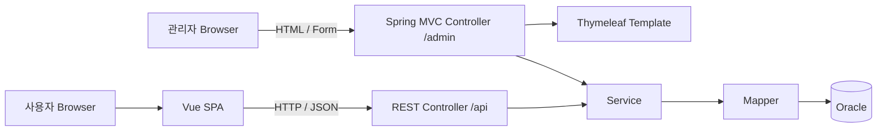

# WithTrip (Travel Planner)

여행 일정과 방문 장소, 이동 동선을 함께 관리하는 4인 팀 프로젝트입니다. 사용자 화면은 **Vue 3 SPA**, 사용자 API는 **Spring Boot REST API**로 구현합니다. 관리자 화면은 **Spring MVC + Thymeleaf**로 서버에서 렌더링합니다.

> 서비스명 `WithTrip`은 임시명이며 저장소와 백엔드 산출물 이름은 `travel-planner`를 사용합니다.

## 프로젝트 구성

| 영역 | 기술 |
| --- | --- |
| 사용자 화면 | Vue 3, Vite 8, Vue Router, Pinia, Axios |
| 관리자 화면 | Spring MVC, Thymeleaf, Spring Security Form Login |
| 백엔드 | Java 21, Spring Boot 4.0.7, Spring MVC, Spring Security |
| 데이터 접근 | MyBatis 3 |
| 데이터베이스 | Oracle Database |
| 테스트 | Vitest, JUnit 5, MockMvc |
| 배포 | AWS EC2 Ubuntu 24.04 LTS, Nginx, Docker Compose, PuTTY 기반 수동 배포 |
| 문자 인코딩 | UTF-8 |

현재 애플리케이션 구조는 다음과 같습니다.



### 화면 구성 기준

- 사용자 화면과 `/api/**`는 기존 Vue SPA·REST API 구조를 유지합니다.
- 관리자 화면과 Form 처리 URL은 `/admin/**` 아래에 두고 Thymeleaf View를 반환합니다.
- 관리자 기능은 `backend`의 `admin` 패키지와 관리자 전용 Template·정적 자원에서 관리합니다.

UI 및 데이터 모델 원본은 [설계 자료](docs/README.md)에서 확인합니다. Vue 사용자 화면의 공통 레이아웃, orange design token과 공통 UI Component 사용법은 [공통 레이아웃·UI Component 가이드](docs/frontend/common-layout-ui.md)를 기준으로 합니다. 관리자 공통 Layout은 `backend/src/main/resources/templates/admin/fragments/`, 정적 자원은 `backend/src/main/resources/static/assets/admin/`에서 관리합니다.

세부 코딩 규칙과 PR 체크리스트는 [CONTRIBUTING.md](CONTRIBUTING.md)를 확인합니다.

## 현재 구현 범위

- 사용자: 회원가입·로그인·세션, 여행 플랜 생성·편집·삭제·복원, 일정 및 장소 편집, 공개 플랜 검색·상세·좋아요·복사·신고, 협업 초대, 공지 조회
- 관리자: Form Login, 대시보드, 회원 조회·상태 변경, 공지 작성·수정·삭제, 여행 플랜 조회·추천 규칙 관리, 신고 처리, TourAPI 데이터 화면
- 공통 백엔드: 지역·장소 검색, TourAPI·Kakao 연동, 초대 메일, 상태 확인 API, Oracle 운영 Schema와 H2 `local` 개발 Profile

## 1. 필수 프로그램

| 프로그램 | 기준 | 확인 명령 |
| --- | --- | --- |
| Git | 팀 공통 최신 안정 버전 | `git --version` |
| JDK | 21 | `java -version`, `javac -version` |
| Node.js | 24.12 이상(24 LTS 권장) | `node -v` |
| npm | Node.js에 포함 | `npm -v` |
| Oracle Database | 팀 지정 버전 | DB 접속 테스트 |

- Gradle은 별도로 설치하지 않고 `backend`의 Gradle Wrapper를 사용합니다.
- Node.js 버전은 루트의 `.nvmrc`에 맞춥니다.
- IDE는 Java 21과 Vue 3를 지원하는 최신 버전을 사용합니다.
- Java와 Gradle JVM은 모두 Java 21로 지정합니다.
- 모든 파일은 UTF-8, 줄바꿈은 LF를 사용합니다.

## 2. 저장소 내려받기

```bash
git clone -b dev https://github.com/noblesi/travel-planner.git
cd travel-planner
git status
```

기능 개발 전에 항상 최신 `dev`를 받고 정상 실행 여부를 확인합니다.

```bash
git switch dev
git pull origin dev
```

## 3. 디렉터리 구조

```text
travel-planner/
├── backend/
│   ├── src/main/java/                 # 사용자 REST API, 관리자 MVC와 백엔드 계층
│   ├── src/main/resources/mapper/     # MyBatis XML Mapper
│   ├── src/main/resources/templates/admin/       # 관리자 Thymeleaf Template
│   ├── src/main/resources/static/assets/admin/   # 관리자 CSS·JavaScript
│   ├── src/main/resources/db/local/   # H2 local Schema와 Seed
│   ├── src/main/resources/application.yml
│   ├── src/test/java/                 # JUnit·MockMvc 테스트
│   ├── build.gradle
│   ├── gradlew
│   └── gradlew.bat
├── frontend/
│   ├── src/api/                       # Axios 인스턴스와 API 모듈
│   ├── src/assets/                    # 전역 스타일과 정적 자원
│   ├── src/components/                # 재사용 컴포넌트
│   │   └── ui/                        # Button·Input·Modal·상태·Toast 공통 UI
│   ├── src/layouts/                   # Vue 사용자 화면 공통 레이아웃
│   ├── src/router/                    # Vue Router 설정
│   ├── src/stores/                    # Pinia 전역 상태
│   ├── src/views/                     # Vue 사용자 라우트 화면
│   ├── package.json
│   └── vite.config.js
├── scripts/                           # Windows·Linux 빌드 및 실행 스크립트
├── .env.example                       # 백엔드 환경변수 예시
├── .nvmrc                             # Node.js 공통 버전
├── CONTRIBUTING.md
└── README.md
```

## 4. 환경변수 설정

### 백엔드

루트의 `.env.example`은 값의 형식을 확인하기 위한 예시입니다. 실제 DB 비밀번호와 API 키는 팀 보안 채널로 공유하고 Git에는 커밋하지 않습니다.

Windows에서는 저장소 루트에서 예시 파일을 복사한 뒤 전달받은 값을 입력합니다.

```powershell
Copy-Item .env.example .env.local
```

`.env.local`은 `.gitignore`에 포함되어 있습니다. `scripts/run-backend.ps1`은 이 파일에서 허용된 백엔드 변수만 현재 실행 프로세스에 로드하고, 실제 값은 콘솔에 출력하지 않습니다. `ORACLE_SYSTEM_*`과 `VITE_*`처럼 백엔드 실행에 필요하지 않은 항목은 별도로 로드하지 않습니다.

| 환경변수 | 예시 | 용도 |
| --- | --- | --- |
| `ORACLE_URL` | `jdbc:oracle:thin:@//localhost:1521/FREEPDB1` | Oracle 접속 URL |
| `ORACLE_USERNAME` | `travel_planner` | DB 계정 |
| `ORACLE_PASSWORD` | `change-me` | DB 비밀번호 |
| `SERVER_PORT` | `8080` | 백엔드 포트 |
| `AUTH_ENFORCE_SECURITY` | `false` | 로컬 개발용 인증 강제 여부. 통합 검증·배포에서는 `true` |
| `SESSION_COOKIE_SECURE` | `true` | HTTPS에서는 `true`, 로컬 HTTP에서는 `false` |
| `MAIL_HOST`, `MAIL_PORT` | `smtp.gmail.com`, `587` | 초대 메일 SMTP endpoint |
| `MAIL_USERNAME`, `MAIL_PASSWORD` | `change-me` | SMTP 인증정보 |
| `MAIL_FROM` | `no-reply@withtrip.com` | 초대 메일 발신 주소 |
| `MAIL_CONNECTION_TIMEOUT_MS`, `MAIL_READ_TIMEOUT_MS`, `MAIL_WRITE_TIMEOUT_MS` | `5000` | SMTP 연결·읽기·쓰기 대기 상한 |
| `MAIL_ASYNC_CORE_POOL_SIZE`, `MAIL_ASYNC_MAX_POOL_SIZE` | `2`, `4` | 초대 메일 비동기 실행기 스레드 수 |
| `MAIL_ASYNC_QUEUE_CAPACITY`, `MAIL_ASYNC_AWAIT_TERMINATION` | `100`, `10s` | 비동기 대기열 크기와 종료 대기 시간 |
| `FRONTEND_BASE_URL` | `https://service.example.com` | 초대 수락 링크를 생성할 실제 Frontend 주소 |
| `TOUR_API_SERVICE_KEY` | `change-me` | TourAPI 서비스 인증키 |
| `KAKAO_REST_API_KEY` | `change-me` | Kakao REST API 키 |
| `KAKAO_JAVASCRIPT_KEY` | `change-me` | 관리자 여행 상세 지도용 Kakao JavaScript 키 |

지원 변수의 전체 목록과 기본값은 `.env.example`과 `application.yml`을 함께 확인합니다.

macOS/Linux:

```bash
export ORACLE_URL='jdbc:oracle:thin:@//localhost:1521/FREEPDB1'
export ORACLE_USERNAME='travel_planner'
export ORACLE_PASSWORD='change-me'
export SERVER_PORT='8080'
```

Windows PowerShell에서는 환경변수를 매번 직접 입력하는 대신 실행 스크립트를 권장합니다.

```powershell
.\scripts\run-backend.ps1
```

다른 위치의 환경변수 파일을 사용하려면 `-EnvironmentFile`을 지정합니다.

```powershell
.\scripts\run-backend.ps1 -EnvironmentFile C:\secure\withtrip.env
```

PowerShell 실행 정책으로 스크립트 실행이 차단되면 현재 터미널에만 임시로 허용한 뒤 다시 실행합니다.

```powershell
Set-ExecutionPolicy -Scope Process Bypass
.\scripts\run-backend.ps1
```

Oracle 접속 정보가 아직 준비되지 않은 경우에는 Backend의 `local` Profile을 사용합니다. 이 Profile은 Memory 기반 H2를 Oracle 호환 모드로 실행하고 개발용 Schema와 Seed를 자동으로 적용합니다.

Windows PowerShell:

```powershell
cd backend
.\gradlew.bat bootRun --args="--spring.profiles.active=local"
```

macOS/Linux:

```bash
cd backend
./gradlew bootRun --args='--spring.profiles.active=local'
```

`local` Database는 Application 종료 시 초기화되며 운영 또는 실제 Oracle 검증을 대체하지 않습니다. 시·도 17개와 인증·공지 개발용 관리자·회원·공지 Seed가 포함되어 있습니다. 계정 정보는 [`backend/src/main/resources/db/local/data.sql`](backend/src/main/resources/db/local/data.sql)에서 확인합니다.

`local` Profile의 기본 관리자 계정은 `admin1 / test1234`이며 로컬·테스트 용도로만 사용합니다.

### 프론트엔드

기본 개발 설정은 `frontend/.env.example`과 같습니다.

```dotenv
VITE_API_BASE_URL=/api
VITE_API_PROXY_TARGET=http://localhost:8080
VITE_KAKAO_MAP_KEY=change-me
```

개인 설정이 필요하면 `frontend/.env.local`을 만들고 Git에는 커밋하지 않습니다. Vite 개발 서버는 `/api` 요청을 Spring Boot로 프록시하므로 기본 구성에서는 별도 CORS 설정이 필요하지 않습니다.

TourAPI와 Kakao REST API의 Backend 환경변수 및 Kakao JavaScript SDK 도메인 등록 방법은 [`docs/api/external-api-setup.md`](docs/api/external-api-setup.md)를 따릅니다.

실제 배포 전에는 [`docs/deployment/release-checklist.md`](docs/deployment/release-checklist.md)의 환경 검증, HTTPS Reverse Proxy, Kakao 허용 도메인, Oracle 데모 데이터 점검 항목을 확인합니다.

## 5. 최초 설치

프론트엔드:

```bash
cd frontend
npm ci
```

백엔드(Windows):

```bat
cd backend
gradlew.bat test
```

백엔드(macOS/Linux):

```bash
cd backend
./gradlew test
```

## 6. 개발 실행

Oracle을 실행하고 환경변수를 설정하거나 Backend `local` Profile을 선택한 뒤 백엔드와 프론트엔드를 각각 실행합니다.

### 터미널 1: Spring Boot

Windows:

```powershell
.\scripts\run-backend.ps1
```

macOS/Linux:

```bash
cd backend
./gradlew bootRun
```

백엔드 주소: [http://localhost:8080](http://localhost:8080)

상태 확인 API: [http://localhost:8080/api/health](http://localhost:8080/api/health)

관리자 로그인: [http://localhost:8080/admin/login](http://localhost:8080/admin/login) (로그인 후 `/admin/dashboard`로 이동)

### 터미널 2: Vue

```bash
cd frontend
npm run dev
```

프론트엔드 주소: [http://localhost:5173](http://localhost:5173)

메인 화면의 `Spring Boot API: 연결됨` 문구가 표시되면 프론트엔드와 백엔드 연결이 정상입니다.

## 7. 테스트와 빌드

프론트엔드:

```bash
cd frontend
npm run lint
npm run test:unit -- --run
npm run build
```

프로덕션 정적 파일은 `frontend/dist`에 생성됩니다.

백엔드(Windows):

```bat
cd backend
gradlew.bat clean test bootJar
```

백엔드(macOS/Linux):

```bash
cd backend
./gradlew clean test bootJar
```

실행 JAR는 `backend/build/libs/travel-planner.jar`에 생성됩니다.

Linux 통합 빌드:

```bash
chmod +x scripts/*.sh
./scripts/build.sh
```

통합 빌드는 프론트엔드 설치·린트·테스트·빌드와 백엔드 테스트·JAR 빌드를 차례대로 실행합니다.

## 8. Git 작업 방법

기능은 최신 `dev`에서 별도 브랜치를 만들어 개발합니다.

```bash
git switch dev
git pull origin dev
git switch -c feature/trip-create
```

| 형식 | 용도 | 예시 |
| --- | --- | --- |
| `feature/<기능명>` | 기능 개발 | `feature/trip-create` |
| `fix/<기능명>` | 버그 수정 | `fix/login-validation` |
| `docs/<주제>` | 문서 수정 | `docs/local-setup` |
| `refactor/<대상>` | 구조 개선 | `refactor/trip-service` |

커밋 메시지 예시:

```text
feat: 여행 일정 등록 기능 추가
fix: 로그인 검증 오류 수정
docs: Vue 실행 방법 보완
chore: 프론트엔드 의존성 설정 수정
```

완료한 기능은 테스트 후 `dev`를 대상으로 Pull Request를 생성합니다. 일반 기능 개발에서는 `dev`에 직접 push하지 않습니다.

## 9. 구현 원칙

### 백엔드

- Vue 사용자 화면용 JSON 엔드포인트는 `/api/**` 아래에 둡니다.
- 관리자 페이지 Controller와 Form 처리 URL은 `/admin/**` 아래에 두고 Thymeleaf View 이름을 반환합니다.
- Controller는 요청·응답과 입력 검증만 담당합니다.
- Service는 비즈니스 규칙과 트랜잭션을 담당합니다.
- Mapper는 DB 접근만 담당합니다.
- MyBatis XML은 `src/main/resources/mapper/<기능>/`에 둡니다.
- 성공 응답은 `ApiResponse.success(data)`를 사용합니다.
- 예상 가능한 오류는 `BusinessException`으로 표현합니다.
- 문자열 연결 SQL 대신 MyBatis 파라미터 바인딩을 사용합니다.

### 사용자 화면(Vue)

- `views`는 라우트 단위 화면, `components`는 재사용 UI로 구분합니다.
- 사용자 화면은 `DefaultLayout`을 기본으로 사용하되, 플랜 제작 화면은 지도·일정 작업공간을 위한 전용 Layout을 사용합니다.
- 공통 버튼·입력·Modal·비동기 상태 UI는 `src/components/ui`의 Component를 우선 사용합니다.
- 색상과 layout 수치는 `src/assets/main.css`의 design token을 사용하고 화면별로 brand 색상을 다시 정의하지 않습니다.
- Axios 호출은 컴포넌트에서 직접 작성하지 않고 `src/api` 모듈에 둡니다.
- 둘 이상의 화면에서 공유하는 상태만 Pinia에 둡니다.
- 공통 Header와 Footer는 레이아웃 컴포넌트로 관리합니다.
- 서버 주소와 외부 API 키를 소스 코드에 직접 작성하지 않습니다.
- 비동기 화면은 로딩·성공·빈 결과·실패 상태를 모두 처리합니다.

### 관리자 화면(Thymeleaf)

- 관리자 Template은 `backend/src/main/resources/templates/admin/`에 두고 공통 Header·Sidebar·Footer는 Thymeleaf Fragment로 분리합니다.
- 관리자 CSS·JavaScript·이미지는 `backend/src/main/resources/static/assets/admin/` 아래에서 관리하고 `/assets/admin/**`로 제공합니다.
- 화면 조회는 `GET /admin/**`, 상태 변경은 의미에 맞는 `POST` 요청과 PRG(Post/Redirect/Get) 패턴을 기본으로 합니다.
- 모든 상태 변경 Form에는 Spring Security CSRF Token을 포함합니다.
- 입력 오류는 BindingResult와 Model Attribute로 같은 화면에 표시하고, 성공 결과는 Redirect Attribute로 전달합니다.
- 관리자 인증은 `/admin/**` 전용 Spring Security Filter Chain과 Form Login을 사용합니다.
- 관리자 Controller·Service·Mapper는 `backend/src/main/java/com/noblesi/travelplanner/admin/` 아래에서 기능별로 관리합니다.
- 프론트엔드는 사용자 SPA만 담당하며 관리자 Route와 Component를 두지 않습니다.

## 10. 기능 완료 기준

- [ ] 정상 입력과 정상 조회 확인
- [ ] 필수값 누락과 잘못된 입력 확인
- [ ] 로딩·빈 결과·서버 오류 화면 확인
- [ ] 로그인 전후와 데이터 소유권 확인
- [ ] DB 저장·수정·삭제 결과 확인
- [ ] Vue 사용자 경로 새로고침과 직접 접근 확인
- [ ] 한글·공백·특수문자·날짜 경계값 확인
- [ ] Vue 린트·테스트·빌드 통과
- [ ] Thymeleaf 관리자 작업은 Controller·View MockMvc 테스트 통과
- [ ] 백엔드 테스트·JAR 빌드 통과
- [ ] 비밀값과 담당 범위 밖 파일이 커밋에 포함되지 않음

## 11. 자주 확인할 문제

| 증상 | 우선 확인할 항목 |
| --- | --- |
| Gradle 빌드 실패 | Gradle JVM과 `JAVA_HOME`이 Java 21인지 확인 |
| npm 설치 실패 | Node.js 24 사용 여부와 `node -v` 확인 |
| Oracle 연결 실패 | Listener, 서비스명, URL, 계정·비밀번호 확인 |
| `ORA-12505` | SID 대신 실제 서비스명과 `@//host:port/service` 형식인지 확인 |
| Vue에서 API 호출 실패 | Spring Boot 실행 여부와 Vite 프록시 대상 확인 |
| 8080·5173 포트 충돌 | 기존 프로세스 종료 또는 포트 설정 변경 |
| Mapper 오류 | XML namespace, 인터페이스 경로, statement id 확인 |
| 배포 후 Vue 경로 404 | 웹 서버가 알 수 없는 경로를 `index.html`로 보내는지 확인 |
| Linux에서만 파일을 못 찾음 | import 경로와 실제 파일명의 대소문자 확인 |

## 12. 운영 서버와 수동 배포

### 확정 배포 환경

| 구분 | 사용 기술 | 용도 |
| --- | --- | --- |
| Cloud | AWS EC2 | Application Server 운영 |
| OS | Ubuntu Server 24.04 LTS | EC2 운영체제 |
| 원격 접속 | PuTTY + SSH | 서버 명령 실행과 상태 확인 |
| 파일 전송 | WinSCP 또는 PSCP | JAR와 Frontend 산출물 업로드 |
| Web Server | Nginx | 현재 시연 HTTP, Vue 정적 파일 제공, Reverse Proxy |
| Container | Docker Engine + Docker Compose plugin | Spring Boot Application 실행과 관리 |
| 배포 방식 | 수동 배포 | 자동 배포 및 운영 서버의 `git pull`을 사용하지 않음 |

운영 서버에는 Git 저장소 전체를 배포하지 않습니다. 개발 PC에서 검증된 `travel-planner.jar`와 `frontend/dist`를 생성한 뒤 EC2로 전송합니다.

```text
개발 PC
  ├── Gradle Wrapper -> backend/build/libs/travel-planner.jar
  ├── Vite           -> frontend/dist
  └── WinSCP/PSCP
          |
          v
AWS EC2 (Ubuntu 24.04 LTS)
  ├── Nginx          -> frontend/dist 제공
  └── Docker Compose -> travel-planner.jar 실행
                           |
                           v
                         Oracle
```

### 배포 전 로컬 빌드

Windows 개발 PC에서 다음 검증을 모두 통과시킨 후 산출물을 업로드합니다.

```powershell
cd frontend
npm ci
npm run lint
npm run test:unit -- --run
npm run build

cd ..\backend
.\gradlew.bat clean test bootJar
```

배포 산출물은 다음과 같습니다.

```text
frontend/dist/
backend/build/libs/travel-planner.jar
```

필수 환경변수와 Release 산출물은 업로드 전에 다음 명령으로 추가 검증합니다.

```powershell
powershell -NoProfile -ExecutionPolicy Bypass -File .\scripts\verify-release.ps1
```

현재 EC2 HTTP 시연 산출물을 검증할 때는 `-DeploymentMode HttpDemo`를 추가합니다. 기본값은 운영 HTTPS 검증입니다.

```powershell
powershell -NoProfile -ExecutionPolicy Bypass -File .\scripts\verify-release.ps1 `
  -DeploymentMode HttpDemo
```

### EC2 접속과 파일 전송

- PuTTY 접속 대상은 EC2의 Public IPv4 또는 연결된 Domain이며 Ubuntu AMI의 기본 사용자는 `ubuntu`입니다.
- SSH Port `22`는 EC2 Security Group에서 운영 담당자의 공인 IP만 허용합니다.
- 현재 HTTP 시연에서는 `80`만 외부에 공개합니다. HTTPS 전환 시 `443`을 추가하고 Backend `8080`과 Database Port는 외부에 공개하지 않습니다.
- PuTTY는 Terminal 접속에 사용하고, 산출물 업로드는 같은 SSH Key를 등록한 WinSCP 또는 PSCP를 사용합니다.
- `.env`와 인증정보는 EC2에만 저장하며 JAR, Frontend 정적 파일 또는 Git 저장소에 포함하지 않습니다.

업로드한 산출물은 예를 들어 다음 위치에 배치합니다.

```text
/opt/withtrip/
├── .dockerignore
├── backend/
│   └── build/libs/travel-planner.jar
├── frontend/                       # frontend/dist의 배포본
├── deploy/
│   ├── compose.yaml
│   ├── Dockerfile
│   └── nginx/withtrip-http.conf
└── .env                            # Git 및 배포 산출물에 포함하지 않음
```

### PuTTY 수동 배포

JAR와 Frontend 산출물을 업로드한 뒤 PuTTY로 EC2에 접속하여 Application Container를 다시 생성합니다. 실제 Compose Service 이름은 배포용 `compose.yaml`과 일치해야 합니다.

```bash
cd /opt/withtrip

docker compose -f deploy/compose.yaml config --quiet
docker compose -f deploy/compose.yaml up -d --build backend
docker compose -f deploy/compose.yaml ps
docker compose -f deploy/compose.yaml logs --tail=100 backend
```

Nginx 설정과 Backend 상태를 확인합니다.

```bash
sudo nginx -t
sudo systemctl reload nginx
curl --fail http://127.0.0.1:8080/api/health
```

배포 후 Browser에서 HTTP 사용자 화면, `/api/health`, `/admin/login`, Vue Route 직접 접근과 새로고침을 확인합니다. 실행 순서는 [`deploy/README.md`](deploy/README.md), HTTPS 전환과 운영 점검 항목은 [`docs/deployment/release-checklist.md`](docs/deployment/release-checklist.md)를 따릅니다.

### 변경 유형별 재배포

운영 서버에서 Source Code를 직접 수정하거나 `git pull`로 배포하지 않습니다. 수정사항은 작업 브랜치에서 `dev`로 병합하여 전체 검증한 뒤 `master`에 반영하고, 해당 Release 기준으로 JAR와 Frontend 정적 파일을 다시 생성합니다. HTTP 시연용 환경을 검증할 때는 실제 값이 설정된 로컬 환경 파일을 명시하되 이 파일 자체는 업로드하지 않습니다.

```powershell
cd C:\dev\travel-planner

powershell -NoProfile -ExecutionPolicy Bypass `
  -File .\scripts\verify-release.ps1 `
  -EnvironmentFile .\.env `
  -DeploymentMode HttpDemo
```

재배포 직전에는 EC2의 현재 JAR와 Frontend를 Release 또는 시각 단위로 백업합니다. 이미 존재하는 백업 디렉터리를 덮어쓰지 않도록 새 이름을 사용합니다.

```bash
cd /opt/withtrip

backup_dir="/opt/withtrip/backups/$(date +%Y%m%d-%H%M%S)"
mkdir -p "$backup_dir"
cp backend/build/libs/travel-planner.jar "$backup_dir/"
cp -a frontend "$backup_dir/frontend"
```

변경 유형에 따라 다음 산출물과 작업만 적용합니다.

| 변경 유형 | WinSCP 업로드 또는 서버 수정 대상 | 재배포 작업 |
| --- | --- | --- |
| Backend Code | `backend/build/libs/travel-planner.jar` | Backend Image 재빌드 및 Container 재생성 |
| Frontend Code | `frontend/dist` 내부 파일을 `/opt/withtrip/frontend/`에 업로드 | Nginx가 정적 파일을 직접 제공하므로 Container 재시작 불필요 |
| Backend 환경변수 | EC2의 `/opt/withtrip/.env`를 서버에서 수정 | Compose 설정 검사 후 기존 Image로 Container만 재생성 |
| Nginx 설정 | `deploy/nginx/withtrip-http.conf` | 설정 복사, 문법 검사, Nginx reload |
| Oracle Schema | 검토가 끝난 Migration SQL | Database Backup 후 Migration을 별도 실행하고 Application 기동 검증 |

Backend JAR가 변경된 경우 새 JAR를 업로드한 뒤 다음 명령을 실행합니다. Docker 권한이 없는 계정은 명령 앞에 `sudo`를 붙이며, Docker Socket을 `chmod 666`으로 개방하지 않습니다.

```bash
cd /opt/withtrip

docker compose -f deploy/compose.yaml up -d --build --force-recreate backend
docker compose -f deploy/compose.yaml ps
docker compose -f deploy/compose.yaml logs --tail=100 backend
```

Frontend만 변경된 경우 `frontend/dist`의 내부 파일을 `/opt/withtrip/frontend/`에 덮어씁니다. Nginx 설정이 같다면 reload하지 않아도 되며, 배포 확인 시 Browser에서 강력 새로고침합니다. Vite가 생성한 Asset 파일명에는 Content Hash가 포함되므로 `index.html`과 `assets/`를 같은 Build 결과로 함께 업로드해야 합니다.

`.env`만 변경된 경우 Secret이 출력되지 않는 `config --quiet`로 문법을 검사한 뒤 Image 재빌드 없이 Container를 재생성합니다.

```bash
cd /opt/withtrip

docker compose -f deploy/compose.yaml config --quiet
docker compose -f deploy/compose.yaml up -d --force-recreate --no-build backend
```

Nginx 설정이 변경된 경우에는 새 설정을 적용하기 전에 반드시 문법 검사를 통과시킵니다. `nginx -t`가 실패하면 reload하지 않습니다.

```bash
sudo cp /opt/withtrip/deploy/nginx/withtrip-http.conf /etc/nginx/sites-available/withtrip
sudo nginx -t
sudo systemctl reload nginx
```

재배포가 끝나면 Container Health, 최근 Log, EC2 내부 API와 외부 Reverse Proxy를 순서대로 확인합니다. Compose의 Health가 `healthy`가 되기 전에는 배포 완료로 판단하지 않습니다.

```bash
cd /opt/withtrip

docker compose -f deploy/compose.yaml ps
docker compose -f deploy/compose.yaml logs --tail=100 backend
curl --fail http://127.0.0.1:8080/api/health
curl --fail http://127.0.0.1:8080/api/health/live
curl --fail http://EC2_ELASTIC_IP/api/health
```

문제가 발생하면 선택한 백업 디렉터리의 이전 JAR와 Frontend를 복원한 뒤 Backend를 다시 빌드합니다. 새 Frontend Asset이 남아 있어도 복원된 `index.html`은 이전 Hash Asset을 참조하므로 서비스 복구에는 영향을 주지 않지만, 오래된 Asset 정리는 서비스 정상화 후 별도로 수행합니다.

```bash
cd /opt/withtrip

backup_dir="/opt/withtrip/backups/20260826-1200"
cp "$backup_dir/travel-planner.jar" backend/build/libs/travel-planner.jar
cp -a "$backup_dir/frontend/." frontend/
docker compose -f deploy/compose.yaml up -d --build --force-recreate backend
```

Database Migration이 포함된 배포는 이전 JAR 복원만으로 안전하게 rollback할 수 있는지 먼저 확인해야 합니다. Application은 `ddl-auto=validate`를 사용하므로 Schema를 자동 변경하지 않습니다. 또한 프로필 이미지는 Compose Named Volume에 저장되므로 일반 재배포에서는 `docker compose down -v`를 실행하지 않습니다.

### 운영 및 rollback 원칙

- 운영 서버에서 Source Code나 JAR를 직접 수정하지 않습니다.
- 새 JAR를 교체하기 전에 현재 JAR와 Frontend 배포본을 Release 단위로 백업합니다.
- Database 변경이 포함된 경우 배포 전에 Oracle Backup과 Migration 순서를 확인합니다.
- 장애 발생 시 이전 JAR와 Frontend 배포본을 복원한 후 같은 `docker compose -f deploy/compose.yaml up -d --build backend` 명령으로 재배포합니다.
- `docker compose ps`, Application Log와 `/api/health`를 확인하기 전에는 배포가 완료된 것으로 판단하지 않습니다.
- Docker 및 Nginx Log Rotation과 EC2 Disk 사용량을 주기적으로 확인합니다.
- HTTP 시연용 Docker·Compose·Nginx 설정은 `deploy/`에서 관리합니다. 운영 HTTPS 전환 시 인증서와 `SESSION_COOKIE_SECURE=true`를 별도로 적용합니다.

## 13. 최초 실행 체크리스트

- [ ] `dev` 브랜치 clone 및 최신화 완료
- [ ] Java 21, Node.js 24 설치 확인
- [ ] Oracle 접속 성공
- [ ] 백엔드 환경변수 설정 완료
- [ ] `./gradlew test` 또는 `gradlew.bat test` 통과
- [ ] `npm ci`, 린트, 테스트, 빌드 통과
- [ ] Spring Boot와 Vue 개발 서버 실행 성공
- [ ] 메인 화면에서 API 연결 상태 확인
- [ ] `/admin/login` 로그인과 관리자 주요 화면 확인
- [ ] 개인 `.env` 파일이 Git 추적 대상이 아님

설치 방법, 실행 명령, 환경변수 또는 폴더 구조가 바뀌면 관련 코드와 같은 PR에서 이 README도 수정합니다.
