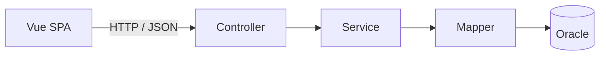

# WithTrip (Travel Planner)

여행 일정과 방문 장소, 이동 동선을 함께 관리하는 4인 팀 프로젝트입니다. 프론트엔드는 **Vue 3 SPA**, 백엔드는 **Spring Boot REST API**로 분리하며, Spring의 MVC 계층 구조와 MyBatis 데이터 접근 계층을 적용합니다.

> 서비스명 `WithTrip`은 임시명이며 저장소와 백엔드 산출물 이름은 `travel-planner`를 사용합니다.

## 프로젝트 구성

| 영역 | 기술 |
| --- | --- |
| 프론트엔드 | Vue 3, Vite 8, Vue Router, Pinia, Axios |
| 백엔드 | Java 21, Spring Boot 4.0.7, Spring MVC |
| 데이터 접근 | MyBatis 3 |
| 데이터베이스 | Oracle Database |
| 테스트 | Vitest, JUnit 5, MockMvc |
| 배포 | Linux, Vue 정적 파일 + Spring Boot 실행 JAR |
| 문자 인코딩 | UTF-8 |



세부 코딩 규칙과 PR 체크리스트는 [CONTRIBUTING.md](CONTRIBUTING.md)를 확인합니다.

## 1. 필수 프로그램

| 프로그램 | 기준 | 확인 명령 |
| --- | --- | --- |
| Git | 팀 공통 최신 안정 버전 | `git --version` |
| JDK | 21 | `java -version`, `javac -version` |
| Node.js | 24 | `node -v` |
| npm | Node.js에 포함 | `npm -v` |
| Oracle Database | 팀 지정 버전 | DB 접속 테스트 |
| IDE | Eclipse/IntelliJ + VS Code 권장 | 버전 확인 |

- Gradle은 별도로 설치하지 않고 `backend`의 Gradle Wrapper를 사용합니다.
- Node.js 버전은 루트의 `.nvmrc`에 맞춥니다.
- Vue 작업은 VS Code와 **Vue - Official** 확장을 권장합니다.
- Java와 Gradle JVM은 모두 Java 21로 지정합니다.
- 모든 파일은 UTF-8, 줄바꿈은 LF를 사용합니다.

## 2. 저장소 내려받기

```bash
git clone -b dev https://github.com/noblesi/travel-planner.git
cd travel-planner
git status
```

기능 개발 전에 항상 최신 `dev`를 받고 정상 실행 여부를 확인합니다.

```bash
git switch dev
git pull origin dev
```

## 3. 디렉터리 구조

```text
travel-planner/
├── backend/
│   ├── src/main/java/                 # REST API와 백엔드 계층
│   ├── src/main/resources/mapper/     # MyBatis XML Mapper
│   ├── src/main/resources/application.yml
│   ├── src/test/java/                 # JUnit·MockMvc 테스트
│   ├── build.gradle
│   ├── gradlew
│   └── gradlew.bat
├── frontend/
│   ├── src/api/                       # Axios 인스턴스와 API 모듈
│   ├── src/assets/                    # 전역 스타일과 정적 자원
│   ├── src/components/                # 재사용 컴포넌트
│   ├── src/layouts/                   # 공통 화면 레이아웃
│   ├── src/router/                    # Vue Router 설정
│   ├── src/stores/                    # Pinia 전역 상태
│   ├── src/views/                     # 라우트 단위 화면
│   ├── package.json
│   └── vite.config.js
├── scripts/                           # Linux 빌드·실행 스크립트
├── .env.example                       # 백엔드 환경변수 예시
├── .nvmrc                             # Node.js 공통 버전
├── CONTRIBUTING.md
└── README.md
```

## 4. 환경변수 설정

### 백엔드

루트의 `.env.example`은 값의 형식을 확인하기 위한 예시입니다. Spring Boot를 실행할 터미널에 환경변수를 등록합니다.

| 환경변수 | 예시 | 용도 |
| --- | --- | --- |
| `ORACLE_URL` | `jdbc:oracle:thin:@//localhost:1521/FREEPDB1` | Oracle 접속 URL |
| `ORACLE_USERNAME` | `travel_planner` | DB 계정 |
| `ORACLE_PASSWORD` | `change-me` | DB 비밀번호 |
| `SERVER_PORT` | `8080` | 백엔드 포트 |

macOS/Linux:

```bash
export ORACLE_URL='jdbc:oracle:thin:@//localhost:1521/FREEPDB1'
export ORACLE_USERNAME='travel_planner'
export ORACLE_PASSWORD='change-me'
export SERVER_PORT='8080'
```

Windows PowerShell:

```powershell
$env:ORACLE_URL='jdbc:oracle:thin:@//localhost:1521/FREEPDB1'
$env:ORACLE_USERNAME='travel_planner'
$env:ORACLE_PASSWORD='change-me'
$env:SERVER_PORT='8080'
```

### 프론트엔드

기본 개발 설정은 `frontend/.env.example`과 같습니다.

```dotenv
VITE_API_BASE_URL=/api
VITE_API_PROXY_TARGET=http://localhost:8080
```

개인 설정이 필요하면 `frontend/.env.local`을 만들고 Git에는 커밋하지 않습니다. Vite 개발 서버는 `/api` 요청을 Spring Boot로 프록시하므로 기본 구성에서는 별도 CORS 설정이 필요하지 않습니다.

## 5. 최초 설치

프론트엔드:

```bash
cd frontend
npm ci
```

백엔드(Windows):

```bat
cd backend
gradlew.bat test
```

백엔드(macOS/Linux):

```bash
cd backend
./gradlew test
```

## 6. 개발 실행

Oracle을 실행하고 환경변수를 설정한 뒤 백엔드와 프론트엔드를 각각 실행합니다.

### 터미널 1: Spring Boot

Windows:

```bat
cd backend
gradlew.bat bootRun
```

macOS/Linux:

```bash
cd backend
./gradlew bootRun
```

백엔드 주소: [http://localhost:8080](http://localhost:8080)

상태 확인 API: [http://localhost:8080/api/health](http://localhost:8080/api/health)

### 터미널 2: Vue

```bash
cd frontend
npm run dev
```

프론트엔드 주소: [http://localhost:5173](http://localhost:5173)

메인 화면의 `Spring Boot API: 연결됨` 문구가 표시되면 프론트엔드와 백엔드 연결이 정상입니다.

## 7. 테스트와 빌드

프론트엔드:

```bash
cd frontend
npm run lint
npm run test:unit -- --run
npm run build
```

프로덕션 정적 파일은 `frontend/dist`에 생성됩니다.

백엔드(Windows):

```bat
cd backend
gradlew.bat clean test bootJar
```

백엔드(macOS/Linux):

```bash
cd backend
./gradlew clean test bootJar
```

실행 JAR는 `backend/build/libs/travel-planner.jar`에 생성됩니다.

Linux 통합 빌드:

```bash
chmod +x scripts/*.sh
./scripts/build.sh
```

통합 빌드는 프론트엔드 설치·린트·테스트·빌드와 백엔드 테스트·JAR 빌드를 차례대로 실행합니다.

## 8. Git 작업 방법

기능은 최신 `dev`에서 별도 브랜치를 만들어 개발합니다.

```bash
git switch dev
git pull origin dev
git switch -c feature/trip-create
```

| 형식 | 용도 | 예시 |
| --- | --- | --- |
| `feature/<기능명>` | 기능 개발 | `feature/trip-create` |
| `fix/<기능명>` | 버그 수정 | `fix/login-validation` |
| `docs/<주제>` | 문서 수정 | `docs/local-setup` |
| `refactor/<대상>` | 구조 개선 | `refactor/trip-service` |

커밋 메시지 예시:

```text
feat: 여행 일정 등록 기능 추가
fix: 로그인 검증 오류 수정
docs: Vue 실행 방법 보완
chore: 프론트엔드 의존성 설정 수정
```

완료한 기능은 테스트 후 `dev`를 대상으로 Pull Request를 생성합니다. 일반 기능 개발에서는 `dev`에 직접 push하지 않습니다.

## 9. 구현 원칙

### 백엔드

- 모든 프론트엔드용 엔드포인트는 `/api/**` 아래에 둡니다.
- Controller는 요청·응답과 입력 검증만 담당합니다.
- Service는 비즈니스 규칙과 트랜잭션을 담당합니다.
- Mapper는 DB 접근만 담당합니다.
- MyBatis XML은 `src/main/resources/mapper/<기능>/`에 둡니다.
- 성공 응답은 `ApiResponse.success(data)`를 사용합니다.
- 예상 가능한 오류는 `BusinessException`으로 표현합니다.
- 문자열 연결 SQL 대신 MyBatis 파라미터 바인딩을 사용합니다.

### 프론트엔드

- `views`는 라우트 단위 화면, `components`는 재사용 UI로 구분합니다.
- Axios 호출은 컴포넌트에서 직접 작성하지 않고 `src/api` 모듈에 둡니다.
- 둘 이상의 화면에서 공유하는 상태만 Pinia에 둡니다.
- 공통 Header와 Footer는 레이아웃 컴포넌트로 관리합니다.
- 서버 주소와 외부 API 키를 소스 코드에 직접 작성하지 않습니다.
- 비동기 화면은 로딩·성공·빈 결과·실패 상태를 모두 처리합니다.

## 10. 기능 완료 기준

- [ ] 정상 입력과 정상 조회 확인
- [ ] 필수값 누락과 잘못된 입력 확인
- [ ] 로딩·빈 결과·서버 오류 화면 확인
- [ ] 로그인 전후와 데이터 소유권 확인
- [ ] DB 저장·수정·삭제 결과 확인
- [ ] Vue 새로고침과 직접 URL 접근 확인
- [ ] 한글·공백·특수문자·날짜 경계값 확인
- [ ] 프론트엔드 린트·테스트·빌드 통과
- [ ] 백엔드 테스트·JAR 빌드 통과
- [ ] 비밀값과 담당 범위 밖 파일이 커밋에 포함되지 않음

## 11. 자주 확인할 문제

| 증상 | 우선 확인할 항목 |
| --- | --- |
| Gradle 빌드 실패 | Gradle JVM과 `JAVA_HOME`이 Java 21인지 확인 |
| npm 설치 실패 | Node.js 24 사용 여부와 `node -v` 확인 |
| Oracle 연결 실패 | Listener, 서비스명, URL, 계정·비밀번호 확인 |
| `ORA-12505` | SID 대신 실제 서비스명과 `@//host:port/service` 형식인지 확인 |
| Vue에서 API 호출 실패 | Spring Boot 실행 여부와 Vite 프록시 대상 확인 |
| 8080·5173 포트 충돌 | 기존 프로세스 종료 또는 포트 설정 변경 |
| Mapper 오류 | XML namespace, 인터페이스 경로, statement id 확인 |
| 배포 후 Vue 경로 404 | 웹 서버가 알 수 없는 경로를 `index.html`로 보내는지 확인 |
| Linux에서만 파일을 못 찾음 | import 경로와 실제 파일명의 대소문자 확인 |

## 12. Linux 배포 방향

- `frontend/dist`는 Nginx 등 정적 웹 서버에서 제공합니다.
- `/api/**` 요청은 `travel-planner.jar`가 실행 중인 백엔드로 전달합니다.
- Vue Router가 history 모드를 사용하므로 알 수 없는 프론트엔드 경로는 `index.html`로 fallback해야 합니다.
- 운영 DB 정보와 API 키는 Linux 환경변수로 등록합니다.
- 배포 전 DB 백업과 되돌리기 절차를 준비합니다.

## 13. 최초 실행 체크리스트

- [ ] `dev` 브랜치 clone 및 최신화 완료
- [ ] Java 21, Node.js 24 설치 확인
- [ ] Oracle 접속 성공
- [ ] 백엔드 환경변수 설정 완료
- [ ] `./gradlew test` 또는 `gradlew.bat test` 통과
- [ ] `npm ci`, 린트, 테스트, 빌드 통과
- [ ] Spring Boot와 Vue 개발 서버 실행 성공
- [ ] 메인 화면에서 API 연결 상태 확인
- [ ] 개인 `.env` 파일이 Git 추적 대상이 아님

설치 방법, 실행 명령, 환경변수 또는 폴더 구조가 바뀌면 관련 코드와 같은 PR에서 이 README도 수정합니다.
