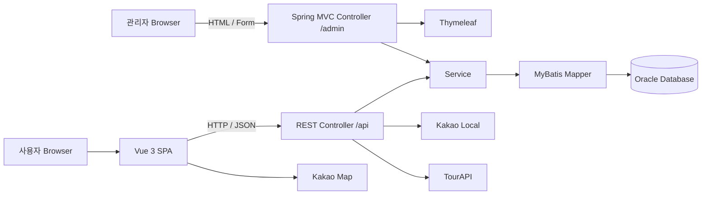

# WithTrip

> 여행 일정 플래너 및 동행자 협업 웹 서비스

목적지와 여행 기간을 설정하고 관광지·음식점·숙소 등을 검색해 DAY별 일정을 구성할 수 있는 **4인 팀 프로젝트**입니다.  
사용자 화면은 **Vue 3 SPA**, 백엔드는 **Spring Boot REST API**, 관리자 화면은 **Spring MVC + Thymeleaf**로 구성했습니다.

Kakao Local·Kakao Map·TourAPI를 연동해 장소 정보를 제공하고, 일정 자동저장과 초대 기능을 통해 하나의 여행 플랜을 여러 사용자가 함께 관리할 수 있도록 구현했습니다.

---

## 프로젝트 개요

| 구분 | 내용 |
| --- | --- |
| 개발 기간 | 2026.07.13 ~ 2026.08.28 (7주) |
| 개발 인원 | 4명 |
| 프로젝트 형태 | 팀 프로젝트 |
| 담당 역할 | 팀장 / 여행 플랜 Full-stack 개발 / 기능 통합 |
| 사용자 화면 | Vue 3, Vite, Vue Router, Pinia, Axios |
| 관리자 화면 | Spring MVC, Thymeleaf, Spring Security Form Login |
| Backend | Java 21, Spring Boot 4, Spring MVC, Spring Security |
| Data Access | MyBatis 3 |
| Database | Oracle Database |
| External API | Kakao Local, Kakao Map, TourAPI |
| Test | Vitest, JUnit 5, MockMvc |
| Deploy | AWS EC2, Ubuntu 24.04, Nginx, Docker Compose |
| Collaboration | Git, GitHub |

> 저장소와 백엔드 산출물 이름은 `travel-planner`, 서비스명은 `WithTrip`을 사용합니다.

---

## 서비스 흐름

```text
여행 지역·기간 설정
        ↓
여행 플랜 생성
        ↓
장소 검색 및 지도 확인
        ↓
DAY별 일정 구성
        ↓
일정 자동저장
        ↓
동행자 초대 및 플랜 공유
```

사용자는 여행 지역과 기간을 기준으로 플랜을 생성한 뒤 장소를 검색해 일정을 구성할 수 있습니다. 일정 변경은 자동으로 저장되며, 공개 플랜 탐색과 복사·좋아요·신고, 동행자 초대 기능도 제공합니다.

---

## 주요 기능

### 사용자

- 회원가입·로그인·세션 관리
- 여행 플랜 생성·편집·삭제·복원
- 목적지 및 여행 기간 설정
- Kakao Local·TourAPI 기반 장소 검색
- Kakao Map 기반 장소 표시
- DAY별 장소 추가·이동·삭제
- 일정 자동저장
- 공개 플랜 검색·상세 조회
- 좋아요·복사·신고
- 동행자 초대 및 플랜 공유
- 공지사항 조회

### 관리자

- Spring Security Form Login
- 대시보드
- 회원 조회 및 상태 변경
- 공지사항 작성·수정·삭제
- 여행 플랜 조회 및 추천 규칙 관리
- 신고 처리
- TourAPI 데이터 조회

---

## 시스템 아키텍처



- 사용자 화면은 Vue SPA와 `/api/**` REST API로 통신합니다.
- 관리자 화면은 `/admin/**` 아래에서 Spring MVC + Thymeleaf로 서버 렌더링합니다.
- Controller는 요청·응답과 입력 검증, Service는 비즈니스 규칙과 트랜잭션, Mapper는 DB 접근을 담당하도록 역할을 분리했습니다.

---

## 담당 역할

### 김민성 | 팀장 / 여행 플랜 Full-stack 개발

본 프로젝트는 4명이 기능 영역을 나누어 진행한 팀 프로젝트이며, 아래 내용은 **개인 담당 및 기여 영역**입니다.

#### 프로젝트 운영·통합

- 팀 내 기술 의견 검토 및 구현 방향 조율
- 기능별 역할 분담과 아키텍처 경계 조율
- 화면·API·Database 사이의 인터페이스 점검
- GitHub 기반 Merge·Review 및 기능 통합

#### 여행 플랜 생성·일정 편집

- 여행 지역·기간 기반 플랜 생성 흐름 구현
- DAY별 장소 추가·이동·삭제 기능 구현
- Vue 3 화면과 Spring Boot REST API 연결
- 일정 변경 결과의 Database 저장 흐름 구현
- 동행자 초대 기능 연동

#### 자동저장 안정성

- Frontend 저장 Queue를 통한 연속 요청 순서 관리
- `operationId`·`requestHash`를 이용한 중복 요청 검사
- `scheduleVersion`·`itemVersion` 기반 수정 충돌 검사
- 충돌 발생 시 최신 일정 재조회 및 사용자 재시도 흐름 구성

#### 외부 API·배포

- Kakao Local·Kakao Map·TourAPI 연동
- 외부 API 응답 정규화 및 Timeout·오류 처리
- AWS EC2 Ubuntu 환경 구성
- Nginx 정적 파일 제공 및 `/api` Reverse Proxy 구성
- Spring Boot Backend Docker Compose 배포

---

## 핵심 구현 1. 일정 자동저장

일정 제작 화면에서는 장소를 추가·이동·삭제할 때마다 변경 내용을 자동 저장합니다.

단순히 변경 이벤트마다 API를 호출하면 빠른 연속 입력이나 네트워크 재시도 상황에서 다음 문제가 발생할 수 있었습니다.

- 요청 순서와 응답 순서가 달라질 가능성
- 동일한 변경 요청의 중복 처리 가능성
- 동행자가 같은 일정 데이터를 동시에 수정할 가능성

이를 Frontend, Backend, Database 단계로 나누어 처리했습니다.

```text
일정 변경
   ↓
저장 Queue
   ↓
REST API
   ↓
operationId / requestHash
중복 요청 검사
   ↓
scheduleVersion / itemVersion
수정 충돌 검사
   ↓
Database 저장
   ↓
화면 상태 갱신
```

### 요청 순서 관리

Frontend에서는 일정 변경 요청을 Queue로 순차 처리해 먼저 발생한 요청부터 서버로 전달되도록 구성했습니다.

```text
변경 A ─┐
변경 B ─┼─> Queue ─> A ─> B ─> C
변경 C ─┘
```

### 중복 요청 검사

네트워크 재시도 등으로 동일 요청이 다시 전달될 수 있으므로 요청 식별값을 이용해 중복 처리를 검사했습니다.

```text
Request
 ├─ operationId
 └─ requestHash
        ↓
중복 여부 검사
   ├─ 기존 요청 → 기존 처리 결과 기준 응답
   └─ 신규 요청 → 저장 처리
```

### 수정 충돌 검사

동일한 여행 플랜을 여러 사용자가 수정할 수 있으므로 Client가 알고 있는 버전과 현재 데이터 버전을 비교했습니다.

```text
Client Version
      ↓
Server Version 비교
   ├─ 일치   → 수정 진행
   └─ 불일치 → Conflict → 최신 일정 재조회
```

이를 통해 정상 저장뿐 아니라 **요청 순서, 멱등성, 동시 수정, 실패·재시도 상황**까지 고려하는 것을 목표로 했습니다.

---

## 핵심 구현 2. 외부 API 연동

장소 데이터는 Kakao Local과 TourAPI를 이용하고, 지도 표시는 Kakao Map을 사용했습니다.

```text
Vue 3
 ├──────────────> Kakao Map
 │
 └─> Spring Boot
       ├─> Kakao Local
       └─> TourAPI
```

서로 다른 외부 API 응답을 애플리케이션에서 사용하기 쉬운 형태로 정리하고, Timeout과 오류 상황을 처리해 외부 서비스 문제로 인한 영향을 줄이도록 구성했습니다.

---

## 핵심 구현 3. AWS EC2 배포

Frontend 정적 파일은 EC2 Host의 Nginx에서 제공하고, `/api` 요청은 Spring Boot Backend로 Reverse Proxy했습니다. Backend는 Docker Compose로 실행했습니다.

```text
사용자 Browser
      ↓
AWS EC2 / Nginx
   ├─ Vue 정적 파일
   └─ /api Reverse Proxy
             ↓
      Spring Boot Backend
        Docker Compose
             ↓
       Oracle Database
```

운영 서버에서 저장소를 직접 수정하지 않고 로컬에서 검증한 JAR와 Frontend 빌드 산출물을 서버로 전달하는 수동 배포 방식을 사용했습니다.

---

## Troubleshooting

### 자동저장 요청의 순서 역전·중복 처리 문제

**문제**  
사용자가 짧은 시간에 여러 일정을 변경하면 연속된 저장 요청이 발생하고, 네트워크 상황에 따라 요청 처리 순서가 달라지거나 동일 요청이 다시 전달될 가능성이 있었습니다.

**해결**

- Frontend: 저장 Queue로 요청 순차 처리
- Backend: `operationId`·`requestHash` 기반 중복 요청 검사
- 데이터 수정: `scheduleVersion`·`itemVersion` 기반 충돌 검사
- 충돌 시 최신 일정 재조회 후 재시도 안내

**배운 점**  
자동저장은 단순히 변경 이벤트마다 API를 호출하는 기능이 아니라 요청 순서, 중복 처리, 동시 수정, 실패 복구까지 함께 고려해야 안정적으로 동작한다는 점을 배웠습니다.

---

## 프로젝트 구조

```text
travel-planner/
├── backend/
│   ├── src/main/java/                 # 사용자 REST API, 관리자 MVC, Service, Mapper
│   ├── src/main/resources/mapper/     # MyBatis XML Mapper
│   ├── src/main/resources/templates/  # 관리자 Thymeleaf Template
│   ├── src/main/resources/static/     # 관리자 정적 자원
│   ├── src/main/resources/db/local/   # H2 local Schema / Seed
│   ├── src/test/java/                 # JUnit / MockMvc 테스트
│   └── build.gradle
├── frontend/
│   ├── src/api/                       # Axios API 모듈
│   ├── src/components/                # 재사용 Component
│   ├── src/layouts/                   # Layout
│   ├── src/router/                    # Vue Router
│   ├── src/stores/                    # Pinia Store
│   └── src/views/                     # Route View
├── deploy/                            # Docker / Nginx 배포 설정
├── docs/                              # 설계·API·배포 문서
├── scripts/                           # 빌드·실행·검증 Script
├── CONTRIBUTING.md
└── README.md
```

상세 설계 자료는 [`docs/README.md`](docs/README.md), 팀 코딩 규칙과 PR 체크리스트는 [`CONTRIBUTING.md`](CONTRIBUTING.md)에서 확인할 수 있습니다.

---

## 로컬 실행

### 요구 환경

- JDK 21
- Node.js 24 LTS
- npm
- Oracle Database
- Git

Oracle 환경이 준비되지 않은 경우 Backend의 `local` Profile을 이용해 H2 기반 개발 환경을 실행할 수 있습니다.

### Backend

Windows:

```powershell
.\scripts\run-backend.ps1
```

또는 H2 local Profile:

```powershell
cd backend
.\gradlew.bat bootRun --args="--spring.profiles.active=local"
```

macOS / Linux:

```bash
cd backend
./gradlew bootRun
```

- Backend: `http://localhost:8080`
- Health Check: `http://localhost:8080/api/health`
- Admin Login: `http://localhost:8080/admin/login`

### Frontend

```bash
cd frontend
npm ci
npm run dev
```

- Frontend: `http://localhost:5173`

환경변수 예시는 [`.env.example`](.env.example)과 [`frontend/.env.example`](frontend/.env.example)을 참고합니다. 실제 DB 비밀번호와 API Key는 저장소에 커밋하지 않습니다.

---

## 테스트 및 빌드

Frontend:

```bash
cd frontend
npm run lint
npm run test:unit -- --run
npm run build
```

Backend:

```bash
cd backend
./gradlew clean test bootJar
```

Windows에서는 `gradlew.bat`을 사용합니다.

Release 검증과 실제 배포 절차는 [`docs/deployment/release-checklist.md`](docs/deployment/release-checklist.md)와 [`deploy/README.md`](deploy/README.md)를 참고합니다.

---

## Git 협업 방식

기능은 `dev`에서 별도 작업 브랜치를 생성해 개발하고 Pull Request를 통해 통합했습니다.

```bash
git switch dev
git pull origin dev
git switch -c feature/trip-create
```

| Prefix | 용도 |
| --- | --- |
| `feature/` | 기능 개발 |
| `fix/` | 버그 수정 |
| `docs/` | 문서 수정 |
| `refactor/` | 구조 개선 |

예시:

```text
feat: 여행 일정 등록 기능 추가
fix: 로그인 검증 오류 수정
docs: 로컬 실행 방법 보완
refactor: 여행 플랜 서비스 구조 정리
```

---

## 관련 문서

- [설계 자료](docs/README.md)
- [공통 Layout / UI Component 가이드](docs/frontend/common-layout-ui.md)
- [외부 API 설정](docs/api/external-api-setup.md)
- [배포 Release Checklist](docs/deployment/release-checklist.md)
- [배포 가이드](deploy/README.md)
- [Contributing Guide](CONTRIBUTING.md)
