# KMS 여행 플랜 개발 인수인계

최종 정리일: 2026-08-07

## 저장소 상태

- 원격 저장소: `https://github.com/noblesi/travel-planner.git`
- 작업 브랜치: `KMS`
- 현재 통합 기준: `808e7af 공개 플랜 수정 후 탐색 캐시 갱신` Commit
- 인수인계 문서 최초 추가 Commit: `91f1bdf docs: KMS 여행 플랜 개발 인수인계 추가`
- 현재 작업 묶음: 기존 `MEMBER` 기반 이메일 로그인, 플랜 생성·자동 저장·발행·탐색·상세·초대·공동편집, Oracle 생명주기 검증과 실제 TourAPI·Kakao Map Browser 흐름까지 구현 완료
- 사용자 노출 서비스명: `WithTrip`
- 백엔드 애플리케이션 및 산출물명: `travel-planner`

현재 `dev`에만 있는 Commit은 `KMS`에 반영하지 않기로 결정했다. 4번 인증 연동 요청에 따라 `LoginView.vue`와 공통 Header의 mock 인증은 실제 local session API로 교체했지만 회원가입 화면은 다른 담당자의 작업 범위로 유지한다.

## 2026-08-03 후속 작업

- 이메일 로그인 Provider를 환경변수 Credential에서 `WITHTRIP_DEV.MEMBER.EMAIL + PASSWORD_HASH` 조회와 BCrypt 검증으로 교체했다.
- `MEMBER_STATUS = 'ACTIVE'`와 `PASSWORD_HASH IS NOT NULL` 조건을 적용하고 탈퇴·Google 전용 회원을 동일한 인증 실패로 처리했다.
- 기존 물리 구조를 따라 Google 로그인은 `GOOGLE_ACCOUNT_LINK.GOOGLE_SUBJECT`를 사용하기로 확정했으며 OIDC 구현은 남아 있다.
- `demo.*@withtrip.example` 회원 3명과 공개 플랜 6건을 영구 시연 데이터로 적용했다. 데모 회원은 `PASSWORD_HASH = NULL`로 로그인할 수 없다.
- `e2e.*@withtrip.test` 임시 회원으로 Oracle 보안 강제 세션에서 로그인, 플랜 생성·수정, 초대·수락, 공동 일정 편집을 검증하고 관련 데이터를 정리했다.
- `GET /api/plans`, `GET /api/plans/{planId}` 공개 API와 MyBatis 읽기 모델을 구현하고 탐색·상세 화면의 mock 데이터를 제거했다.
- Oracle에서 전체 공개 플랜 6건, 서울 검색 1건과 상세 일정 응답을 확인했다. Browser에서 데스크톱·390px 모바일 한글 렌더링과 가로 넘침 없음도 확인했다.
- Backend 전체 74건, Frontend 전체 85건 Test와 Frontend Production Build가 통과했다.

다른 컴퓨터에서는 다음 명령으로 작업을 시작한다.

```bash
git clone -b KMS https://github.com/noblesi/travel-planner.git
cd travel-planner
git status
```

이미 저장소가 있다면 다음 명령을 사용한다.

```bash
git switch KMS
git pull origin KMS
```

## KMS 전용 문서 관리

`docs/handoff/KMS-travel-plan-handoff.md`는 `KMS` Branch에서만 추적하고 `dev`, `master` 또는 다른 팀원 Branch에는 반영하지 않는다.

Git Push는 파일이 아니라 Commit을 전송하므로 다음 규칙을 사용한다.

- `KMS` 전체를 다른 Branch에 직접 Merge하거나 `KMS`에서 대상 Branch로 Pull Request를 만들지 않는다.
- 다른 Branch에 반영할 때는 해당 대상 Branch에서 통합 Branch를 만들고 필요한 기능 Commit만 Cherry-pick한다.
- Handoff를 함께 수정한 과거 Commit이 필요하면 Cherry-pick 후 이 파일 변경만 제거하고 Commit을 정리한다.
- 새 Handoff 갱신 Commit은 가능한 한 이 파일만 포함해 기능 Commit과 분리한다.
- Push 전에 대상 Branch의 변경 목록에 이 파일이 없는지 확인한다.

```bash
git diff --name-only origin/dev...HEAD -- docs/handoff/KMS-travel-plan-handoff.md
```

위 명령은 `KMS` 외 Branch에서 아무 경로도 출력하지 않아야 한다.

## 현재 반영된 자료

- UI 설계서: `docs/design/UI설계.pdf`
- ERD 원본: `docs/database/travelplanner_v2.exerd`
- 여행 플랜 Oracle DDL: `docs/database/ddl/`
- 여행 플랜 1차 API 계약: `docs/api/travel-plan-api.md`
- API 오류 코드: `docs/api/error-codes.md`
- 파비콘: `frontend/public/favicon-32.png`, `favicon-64.png`, `favicon-192.png`, `favicon-512.png`
- 헤더 및 심볼 로고: `frontend/src/assets/branding/`
- 웹 앱 매니페스트: `frontend/public/site.webmanifest`
- 헤더 로고 적용: `frontend/src/components/AppHeader.vue`

플랜 생성 HTTP 계약과 Transaction을 회귀 검증하기 위해 Spring Boot 4 JUnit·MockMvc 통합 테스트 구성을 추가했다.

## 이번 작업 완료 사항

- 여행 플랜 핵심 Table 8개, Sequence 4개, Index 11개, Constraint 46개를 Oracle DDL로 작성했다.
- TourAPI 시·도 코드 17건을 `REGION_MASTER` 초기 Data로 작성했다.
- 인증이 확정되기 전에도 Schema를 생성할 수 있도록 `MEMBER`, `ADMIN` 외래키는 선택 Script로 분리했다.
- `GET /api/regions`, `POST /api/plans`, `GET /api/plans/{planId}/editor` 계약을 확정했다.
- 공통 오류 응답은 기존 `ErrorResponse` 구조와 일치하도록 작성했다.
- Oracle `NUMBER(19)` ID는 JavaScript 정밀도 손실을 막기 위해 JSON 문자열로 반환하기로 결정했다.
- DDL과 eXERD Column·Type 비교, SQL 정적 검사, Seed 중복 검사, API JSON Example Parsing과 문서 링크 검사를 완료했다.
- `GET /api/regions`의 Controller, Service, MyBatis Mapper와 Response DTO를 구현했다.
- 로컬 로그인과 Google OIDC를 하나의 회원 및 Spring Security Session으로 통합하는 인증 방식을 확정했다.
- Oracle 접속 정보가 확정되기 전에도 개발할 수 있도록 H2 Oracle 호환 `local` Profile을 추가하고 지역 17건 응답을 검증했다.
- H2 `local` Schema에 `TRAVEL_PLAN`, `PLAN_MEMBER`, `PLAN_DAY`와 플랜·일차 Sequence를 추가했다.
- H2 `local` Schema에 제작 초기 조회와 일정 개발을 위한 `PLAN_SCHEDULE_ITEM`, `SEQ_PLAN_SCHEDULE_ITEM` 및 Oracle 기준 Constraint를 추가했다.
- H2 일정 항목 Schema 보완 후 `clean test bootJar`를 실행해 Backend Test 8건과 실행 JAR 생성을 다시 확인했다.
- 초기에는 `LocalCurrentMemberProvider`와 인증 미연동 기본 Profile용 Provider를 사용했고, 현재 기본 Profile은 `SecurityCurrentMemberProvider`로 교체했다.
- 플랜 생성 Request DTO, 공개 범위 Enum, 날짜 범위·14일 제한 검증과 `MALFORMED_JSON` 처리를 구현했다.
- 플랜·생성자·일차를 하나의 Transaction으로 저장하는 MyBatis Mapper와 `TravelPlanService`를 구현했다.
- 생성 응답의 Oracle `NUMBER(19)` ID를 JSON 문자열로 변환하고 일차 목록을 조립하도록 구현했다.
- `TravelPlanController`에서 `POST /api/plans`를 연결하고 `201 Created`, `Location` Header를 구현했다.
- H2 `local` Profile에서 플랜 생성 HTTP 계약, DB 정합성, 실패 시 Transaction Rollback을 통합 검증했다.
- 여행 플랜 설정 페이지, 지역·플랜 API Module, 설정 Form과 생성 후 제작 화면 이동을 구현했다.
- Desktop·Mobile 화면과 지역 조회부터 플랜 생성·제작 Route 이동까지 Browser로 검증했다.
- Gradle Build, MyBatis XML Parsing, H2 `local` Profile 및 기본 Profile 기동을 확인했다.
- `GET /api/plans/{planId}/editor`의 Controller, Service, MyBatis 조회 Mapper와 응답 DTO를 구현했다.
- 편집 초기 조회에서 활성 플랜과 현재 회원 소유권을 함께 검사하고, 미존재·삭제·타인 소유 플랜을 모두 `PLAN_NOT_FOUND`로 처리했다.
- 잘못된 형식, 0 이하, Java `long` 범위를 초과한 `planId`를 `INVALID_PATH_PARAMETER`로 처리했다.
- H2 `local` Schema에 `PLAN_SCHEDULE_ITEM` Table, Sequence와 Oracle 기준 Constraint를 추가했다.
- 일차는 `DAY_NO`, 일정은 `MORNING`·`AFTERNOON`과 `POSITION_NO` 순서로 조회하고 빈 일정은 `items: []`로 반환하도록 구현했다.
- JavaScript 안전 정수를 넘는 플랜·일차·일정 ID가 JSON 문자열로 손실 없이 반환되는지 통합 검증했다.
- Backend Test를 일정 자동 저장 통합 Test까지 확장했다.
- 제작 페이지에 DAY 선택, 오전·오후 일정 카드, 선택 DAY 기준 빈 상태와 여행 시작일·종료일 변경 UI를 구현했다.
- `PATCH /api/plans/{planId}/dates`를 구현하고 일정이 포함된 DAY 제외 시 확인 후 강제 변경하는 흐름과 날짜 범위 검증을 추가했다.
- TourAPI와 Kakao 외부 API 환경변수 계약, 설정 객체와 설정 검증 Test를 추가했다.
- `GET /api/places/search`와 `TourApiClient`를 구현하고 TourAPI 오류를 공통 API 오류로 변환하도록 구성했다.
- 플랜 설정 Form의 필수 입력·서버 오류·중복 제출 처리를 보완하고 지역 선택을 사이트 스타일의 하단 고정 커스텀 드롭다운으로 교체했다.
- 플랜 생성 성공과 제작 화면 이동 실패를 분리해 생성 완료 후에는 중복 생성 없이 이동만 재시도하도록 보완했다. 제작 화면은 일정·제목·공개범위·날짜 저장을 하나의 대기 상태로 추적하고, 저장 실패 이탈 확인·브라우저 종료 경고·홈 복귀 경로를 적용했다.
- 날짜 변경 확인창에 초기 포커스·Escape 닫기·Tab 순환·저장 버튼 포커스 복귀를 적용했다. 플랜 설정은 시작일 변경으로 기존 종료일이 역전되거나 14일을 초과하면 종료일을 초기화하고 이유를 안내하며, 로컬 검증 오류를 서버 필드 오류보다 우선 표시한다. 기본 공개 범위는 제품 정책에 따라 `PUBLIC`을 유지한다.
- 한국 시간 오늘 계산·날짜 덧셈·포맷·포함 일수 계산을 `frontend/src/utils/travelDate.js`로 통합하고 한국 시간 자정 경계·윤년 회귀 Test를 추가했다. Backend의 `Clock`·`Asia/Seoul` 날짜 계약과 같은 기준을 유지한다.
- `PlanEditorView`를 Toolbar·일정 Panel·지도 작업 영역으로, `PlanDetailView`를 Header·일정·DAY 요약·지도로 분리했다. `PlanScheduleService`는 외부 API를 유지하는 Facade로 축소하고 추가·수정·삭제·정렬 Transaction Service와 공통 Mutation 지원 객체로 책임을 나눴다.
- Backend 서비스 책임을 추가로 정리해 `TravelPlanService`는 생성·에디터 조회·Metadata·날짜 변경 Facade로, `PlanInvitationService`는 초대 생성·조회·수락 Facade로 축소했다. 플랜 접근 검증·양수 ID Parsing·DAY 범위 동기화·일정 작업 원장·초대 Token 생성/Hash/만료 계산은 각각 전용 Component가 담당한다.
- 기존 `TravelPlanMapper`는 플랜 명령·접근 조회·참여자·공개 조회 Mapper와 XML로 분리했다. 제작 화면 장소 검색의 `TourApiClient`는 Facade만 유지하고 HTTP 요청·통신 오류는 `TourApiHttpClient`, JSON·공급자 응답 해석과 장소 정규화는 `TourApiResponseParser`가 담당한다.
- 실제 Memory Router를 사용하는 전체 흐름 회귀 Test를 추가해 로그인 → 플랜 설정 → 생성 → 제작 진입, 제목·날짜 변경 → 장소 추가·자동 저장, 공개 상세 복귀 후 검색 Cache 복원, 진행 중·종료 플랜 날짜 제한을 검증했다.
- 원격 Oracle Application Schema에 전체 DDL을 적용하고 시·도 Seed 17건을 입력했으며, `/api/health`와 `/api/regions`를 실제 Oracle 연결로 확인했다.
- 실제 접속정보와 인증키는 Git에서 제외되는 루트 `.env.local`에 보관하고, Windows 실행용 `scripts/run-backend.ps1`과 팀 실행 절차를 추가했다.
- `frontend/src/api/places.js`와 장소 검색 Panel·상세 Card를 추가하고 검색어 검증, Loading·Empty·Error, Pagination과 결과 선택 상태를 구현했다.
- 제작 페이지의 검색 결과와 선택 DAY에 저장된 일정 장소를 하나의 지도 Marker 목록으로 연결했다.
- Kakao SDK Loading·Key 누락·Load 실패·빈 Marker 상태와 Marker 선택 정보창을 처리하는 공용 `KakaoMap` Component를 구현했다.
- 기존 공개 플랜 상세 화면도 공용 `KakaoMap` Component를 사용하도록 변경해 중복 지도 구현을 제거했다.
- 장소 검색 API·Panel·Kakao Map·제작 화면 Test를 추가하고 대상 ESLint·Oxlint를 통과했다.
- H2 local 제작 화면을 Desktop·Mobile Browser로 확인하고 장소 검색 Panel과 Kakao Key 미설정 오류 상태를 검증했다.
- 일정 추가·시간대 수정·삭제·정렬 API의 Request·Response, Snapshot, `operationId`, `scheduleVersion`·`itemVersion` 계약을 확정했다.
- `PLAN_EDIT_OPERATION.REQUEST_HASH`를 추가해 같은 작업 ID의 동일 Payload 재시도는 멱등 성공하고 다른 Payload 재사용은 `DUPLICATE_OPERATION`으로 차단하도록 구현했다.
- 일정 추가 시 선택 시간대 마지막 배치, 시간대 이동·삭제 시 순번 압축, 정렬 시 전체 ID 목록 원자적 교체를 구현했다.
- 일정 변경과 DAY·항목 Version 갱신, 작업 이력 저장을 하나의 Transaction으로 묶고 소유권·버전 충돌·중복 장소·시간대별 100개 제한을 구현했다.
- H2 local Schema에 `PLAN_EDIT_OPERATION`을 추가하고 일정 자동 저장 통합 Test 11건을 추가했다.
- Frontend 일정 추가·오전/오후 이동·삭제·위아래 정렬 UI를 일정 API에 연결하고 저장 중·완료·실패·충돌 상태를 표시하도록 구현했다.
- Pinia 편집 Store에 직렬 자동 저장 Queue를 추가하고, Queue 실행 시점의 최신 DAY·항목 Version 사용, 동일 `operationId` 재시도, `409 Conflict` 최신 Editor Snapshot 복구 흐름을 구현했다.
- Frontend API·Store·View Test를 확장했으며 변경 대상 ESLint·Oxlint를 통과했다.
- 실제 TourAPI Key로 서울 지역 장소 검색 22건을 확인하고, 검색 결과를 H2 일정에 추가·오후 이동·삭제해 일정 Version이 0에서 3으로 증가하는 전체 API 흐름을 검증했다.
- 실제 Kakao REST Key로 공식 장소 검색 API 응답을 확인하고, JavaScript Key와 등록 도메인 `http://localhost:5173`에서 실제 지도·Marker·정보창 브라우저 렌더링을 확인했다.
- 원격 Oracle에 `005_add_plan_operation_request_hash.sql`을 적용하고 `REQUEST_HASH VARCHAR2(64) NOT NULL`, `CK_PLAN_OPERATION_HASH ENABLED VALIDATED` 상태를 확인했다.
- 원격 Oracle의 활성 시·도 Seed가 0건인 상태를 발견해 멱등 `002_seed_region_master.sql`을 다시 적용하고 17건을 복구했다.
- Oracle JDBC에서 선택 Snapshot 필드와 정렬 작업 대상 ID가 `null`일 때 발생하는 `ORA-17004`를 막도록 MyBatis Parameter에 명시적 JDBC Type을 추가했다.
- P4 전용 임시 회원으로 Oracle 플랜 생성, 동일 작업 멱등 재시도, 일정 2건 추가·정렬·시간대 이동·삭제를 검증했다. DAY Version은 0에서 6으로 증가했고 작업 이력 6건의 Hash가 모두 유효했으며, 검증 플랜·회원·작업 이력은 종료 후 삭제했다.
- 플랜 제목·공개 범위 변경을 owner-only optimistic locking으로 구현하고 Frontend 편집 Form에 연결했다.
- 초대 token 원문을 응답에만 노출하고 SHA-256 Hash만 저장하는 24시간 초대 링크 생성·조회·수락을 구현했다. 재발급 시 이전 pending 링크 취소, 동일 회원의 멱등 수락, 초대 참여자의 일정 편집 권한을 검증했다.
- Spring Security 서버 session, CSRF, session fixation 방어, `MemberPrincipal`, `SecurityCurrentMemberProvider`를 구현했다.
- 초기 `local` 환경변수 Credential 로그인을 구현했으며, 2026-08-03에 Oracle `MEMBER` DB 로그인으로 교체했다. Session 조회·로그아웃 API와 Vue 인증 API·Pinia Store·redirect·Header 상태는 그대로 사용한다.

플랜 생성·편집·Metadata·초대 API의 H2 통합 검증과 Oracle Schema·지역 조회·일정 CRUD 검증을 완료했다. 2026-08-03에는 실제 Oracle `MEMBER` 인증으로 로그인·플랜·초대·공동편집 E2E까지 검증하고 임시 데이터를 정리했다. 기본 Profile은 인증 없는 보호 요청을 차단하며 Google OIDC 연결은 남아 있다.

원격 Oracle에는 `MEMBER`, `ADMIN` Table과 `003_add_identity_foreign_keys.sql`의 FK 7개가 이미 적용돼 모두 `ENABLED` 상태다. 재실행하지 않는다.

## 리소스 점검

2026-08-01 기준 점검 결과다.

| 구분 | 상태 | 비고 |
| --- | --- | --- |
| Git | 준비 완료 | 일정 CRUD·자동 저장 Backend·Frontend와 Oracle 검증 변경을 `2366508`로 Commit, Handoff는 별도 Commit으로 관리 |
| Java | 준비 완료 | Temurin JDK 21.0.11 |
| Gradle | 준비 완료 | Wrapper 9.5.1, `clean test bootJar` 성공 |
| Backend JAR | 준비 완료 | `backend/build/libs/travel-planner.jar` 생성 |
| H2 local DB | 준비 완료 | 지역 17건, 플랜·생성자·일차·일정 항목 Schema와 Sequence 포함 |
| MyBatis | 준비 완료 | 지역·플랜·일차·일정 항목 Mapper Interface와 XML 1:1 대응 |
| Backend local 기동 | 준비 완료 | `/api/health` UP, `/api/regions` 17건 확인 |
| UI·ERD·DDL | 준비 완료 | PDF, eXERD, Oracle DDL 5개와 문서 Link 확인. 기존 Schema용 `005` 포함 |
| Branding | 준비 완료 | Favicon, Manifest, Header·Symbol Logo 확인 |
| Node.js·npm | 준비 완료 | 현재 환경 Node.js 24.14.0, npm 11.11.1. `package.json` Engine 범위 충족 |
| Frontend Build | 준비 완료 | Production Build와 ESLint·Oxlint 통과 |
| Oracle | 일정 범위 검증 완료 | `005` 적용, 시·도 Seed 17건 복구, Schema 검증, 임시 회원 기반 플랜 생성·일정 CRUD·정렬·멱등 재시도 완료 |
| 실제 인증 | 부분 완료 | Spring Security session·CSRF와 Oracle `MEMBER` 이메일 로그인 완료. 회원가입·비밀번호 재설정·Google OIDC 필요 |
| 외부 API | 검증 완료 | 실제 TourAPI 검색, Kakao REST Key와 JavaScript SDK 응답 및 localhost Kakao Map·Marker·정보창 Browser 렌더링 확인 |
| Backend 자동 Test | 준비 완료 | 전체 Test와 `bootJar` 성공 |
| Frontend Test | 준비 완료 | 32개 Test File, 전체 139건 통과, Production Build 성공. ESLint·Oxlint 통과 |
| Windows 실행 | 준비 완료 | 루트 `.env.local`을 안전하게 로드하는 `scripts/run-backend.ps1` 추가 |

4단계 `POST /api/plans` Controller와 H2 HTTP·Transaction 통합 검증을 `local` Profile에서 완료했다.

후속 작업에서 추가하거나 정리할 리소스:

- `frontend/src/api/plans.js`, `regions.js`, 설정 View, 제작 View와 `planEditor` Store를 구현했다.
- `PlanScheduleItemMapper`와 편집 초기 조회 응답 DTO, 일정 추가·시간대 수정·삭제·정렬 Mapper를 구현했다.
- `TourApiClient`, 장소 검색 Controller·Service·DTO·Frontend API Module·검색 Panel·상세 Card와 자동 Test를 추가했다.
- `frontend/src/components/map/KakaoMap.vue`를 공용 지도 Component로 사용하며 제작 화면과 공개 플랜 상세 화면이 함께 참조한다.
- Root `.env.example`에는 Oracle·TourAPI·Kakao REST 변수명이 있으며 실제 값은 `.env.local`과 팀 보안 채널에서만 관리한다.
- Vue SPA에서 사용하지 않던 JSP header/footer, legacy `layout.css`, `/testView` 개발 라우트는 2026-08-04 정리했다.
- 공개 플랜 검색은 `page`/`size` 서버 페이지네이션을 사용하며, 기존 `limit` Parameter도 호환을 위해 유지한다.
- 공개 플랜 검색은 5분 Pinia 캐시로 검색어·페이지·카드 목록을 복원하며, 새 검색·초기화·더 보기 사이의 늦은 응답을 무시한다. 썸네일 기본값과 로딩 실패 대체 이미지는 외부 임시 서비스가 아닌 로컬 SVG를 사용한다.
- 설정 화면의 지역 선택기는 `RegionSelect`, 제작 화면의 제목·공개범위·날짜 설정은 `PlanEditorSettings`로 분리했다.
- 제작 화면은 `PlanEditorToolbar`, `PlanEditorSchedulePanel`, `PlanEditorMapWorkspace`, 공개 상세 화면은 `PublicPlanDetailHeader`, `PublicPlanSchedule`, `PublicPlanDaySummary`, `PublicPlanDayMap`으로 분리했다.
- 일정 변경 Backend는 `PlanScheduleService` Facade 뒤에서 `PlanScheduleAddService`, `PlanScheduleUpdateService`, `PlanScheduleDeleteService`, `PlanScheduleReorderService`가 작업별 Transaction을 담당한다.
- Root README의 JUnit·MockMvc와 `src/test/java` 안내에 맞춰 Backend 통합 테스트 구성을 복구했다.

## 담당 개발 범위

담당 화면은 다음 두 가지다.

1. 여행 플랜 설정 페이지
2. 여행 플랜 제작 페이지

개발 범위에는 프런트엔드와 백엔드 API가 모두 포함된다.

UI 설계서 기준 참고 화면:

- 28페이지: 새로운 여행 계획 설정
- 30페이지: 여행 플랜 제작 및 지도 편집

## 확정된 요구사항

| 항목 | 결정 내용 |
| --- | --- |
| 여행지역 | 국내 |
| 일정 시간 | 오전 / 오후 |
| 플랜 제목 | `{지역명} 여행`으로 자동 생성 후 수정 가능 |
| 저장 방식 | 추가·수정·삭제·순서 변경 작업마다 자동 저장 |
| 장소 데이터 | 한국관광공사 TourAPI |
| 지도 | 카카오맵스 API |
| 인증 방식 | Spring Security 서버 세션, 로컬 로그인 + Google OIDC |
| 초대 기능 | 포함 |
| DB 테이블 | 원격 Oracle 전체 DDL·시도 Seed 적용, H2 local에는 플랜 편집 개발 범위 적용 완료 |

인증 및 계정 연결의 상세 기준은 `docs/auth/authentication-decision.md`를 따른다. 그 밖에 결정되지 않은 항목은 임의로 확정하거나 코드에 고정하지 않는다.

## 외부 API 사용 원칙

- TourAPI는 서비스 키 보호와 응답 형식 통일을 위해 백엔드에서 호출한다.
- 카카오맵 JavaScript SDK는 프런트엔드에서 사용한다.
- 카카오 REST API가 필요하면 백엔드에서 호출한다.
- 키와 비밀번호는 Git에 커밋하지 않는다.

예상 환경변수 이름:

```dotenv
TOUR_API_SERVICE_KEY=
VITE_KAKAO_MAP_KEY=
KAKAO_REST_API_KEY=
```

Windows 팀원은 루트 `.env.example`을 `.env.local`로 복사하고 보안 채널로 전달받은 값을 채운 뒤 아래 명령으로 실행한다. `.env.local`과 `frontend/.env.local`은 Git에 커밋하지 않는다.

```powershell
.\scripts\run-backend.ps1
```

## 인증 연동 상태 처리

회원 ID를 코드에 상수로 고정하지 않는다. 백엔드에는 현재 회원을 제공하는 추상 계층을 둔다.

```text
CurrentMemberProvider
└── 현재 로그인 회원 ID 반환
```

플랜 서비스는 Session이나 Google Claim을 직접 참조하지 않고 이 계층을 사용한다. 기본 Profile의 `SecurityCurrentMemberProvider`는 Spring Security Context의 `MemberPrincipal`에서 회원 ID를 가져오며, 인증이 없으면 `CURRENT_MEMBER_NOT_AVAILABLE`을 반환한다.

이메일 로그인은 기존 `MEMBER.EMAIL`, `MEMBER.PASSWORD_HASH`를 조회하고 BCrypt로 검증한다. Google 로그인은 별도 범용 Identity 테이블을 추가하지 않고 기존 `GOOGLE_ACCOUNT_LINK.GOOGLE_SUBJECT`를 사용할 예정이다. 실제 Oracle 회원 Session으로 플랜 생성·초대 수락·공동편집 E2E를 완료했다.

`local` Profile의 보호 비활성 개발 흐름은 `LOCAL_MEMBER_ID` fallback을 유지하지만 `/api/auth/login`은 H2 `MEMBER` 데이터를 사용한다. `AUTH_ENFORCE_SECURITY=true`이면 플랜 보호 API는 인증 없이는 `401`을 반환한다. 기본 Profile에는 회원 ID fallback이 없다.

## 데이터 모델

우선 사용하는 핵심 테이블은 다음과 같다.

| 테이블 | 용도 |
| --- | --- |
| `REGION_MASTER` | 국내 지역 기준정보 |
| `PLACE_MASTER` | TourAPI 장소 기본정보 |
| `TRAVEL_PLAN` | 플랜 제목, 지역, 기간, 공개 여부, 전체 버전 |
| `PLAN_MEMBER` | 생성자 및 초대 참여자 |
| `PLAN_DAY` | 여행 날짜별 일차와 일정 버전 |
| `PLAN_SCHEDULE_ITEM` | 오전·오후 장소 일정과 표시 순서 |
| `PLAN_EDIT_OPERATION` | 추가·수정·삭제·이동 작업 이력 |
| `PLAN_INVITATION` | 플랜 초대 정보 |

주요 ERD 제약:

- 여행 기간은 최대 14일이며 날짜 정책의 오늘 기준은 `Asia/Seoul`이다. 신규·출발 전 플랜은 오늘 이후만 허용하고, 진행 중 플랜은 시작일을 유지한 채 종료일만 변경하며, 종료된 플랜은 날짜 변경을 금지한다.
- `START_DATE <= END_DATE`여야 한다.
- 공개 범위는 `PUBLIC` 또는 `PRIVATE`다.
- 일정 시간대는 `MORNING` 또는 `AFTERNOON`이다.
- 일정 표시 순서는 1 이상이다.
- 플랜, 일차, 일정 항목에 버전 컬럼이 존재한다.

Oracle DDL과 국내 시·도 초기 데이터는 `docs/database/ddl/`에 작성되어 있고 원격 Application Schema에 적용했다. `REGION_MASTER.REGION_CODE`는 시·도의 경우 TourAPI `areaCode`, 시·군·구의 경우 `{areaCode}-{sigunguCode}` 형식을 사용한다. 현재 Seed는 시·도 17건이며 시·군·구는 향후 TourAPI 동기화 시 추가한다.

## 기능 흐름

```mermaid
flowchart LR
    A["여행 플랜 설정"] --> B["지역·기간·공개 여부 검증"]
    B --> C["플랜 생성 API"]
    C --> D["TRAVEL_PLAN 생성"]
    D --> E["PLAN_MEMBER 생성자 등록"]
    E --> F["여행 기간만큼 PLAN_DAY 생성"]
    F --> G["플랜 제작 페이지 이동"]
    G --> H["TourAPI 장소 검색"]
    H --> I["카카오맵 마커·상세 표시"]
    I --> J["일차와 오전·오후 선택"]
    J --> K["장소 추가·수정·삭제·정렬"]
    K --> L["작업별 자동 저장 및 버전 갱신"]
```



## API 계약 상태

지역 조회, 플랜 생성, 제작 페이지 초기 조회·날짜 변경 계약은 `docs/api/travel-plan-api.md`, 장소 검색 계약은 `docs/api/place-search-api.md`를 기준으로 한다. 공통 오류 형식과 코드는 `docs/api/error-codes.md`를 사용한다.

1차 확정 Endpoint:

```text
GET    /api/regions
POST   /api/plans
GET    /api/plans/{planId}/editor
PATCH  /api/plans/{planId}/dates
GET    /api/places/search?keyword=&regionCode=&page=&size=
```

현재 구현 상태:

| Endpoint | 상태 |
| --- | --- |
| `GET /api/regions` | Backend 구현, H2 및 실제 Oracle 17건 검증 완료 |
| `GET /api/plans` | 공개 검색 Backend·Frontend 구현, H2 및 실제 Oracle 데모 6건 검증 완료 |
| `GET /api/plans/{planId}` | 공개 상세 Backend·Frontend 구현, 조회수·일차·장소 H2 및 Oracle Browser 검증 완료 |
| `POST /api/plans` | Backend 구현, H2 HTTP·Transaction 통합 검증 및 Oracle 임시 회원 기반 생성 검증 완료 |
| `GET /api/plans/{planId}/editor` | Backend 구현, H2 소유권·정렬·ID 정밀도 및 Oracle 일정 변경 Snapshot 응답 검증 완료 |
| `PATCH /api/plans/{planId}/dates` | Backend·Frontend 구현 및 H2 날짜 재구성·일정 삭제 확인 흐름·Oracle 날짜 확장 검증 완료 |
| `GET /api/places/search` | Backend·Frontend API·검색 Panel·오류 상태·Pagination 연결과 자동 Test 완료, 실제 TourAPI Key로 서울 장소 검색 검증 완료 |
| `POST /api/plans/{planId}/days/{dayId}/items` | 계약·Backend·Frontend 연결, H2 멱등·Transaction·충돌 및 Oracle nullable Snapshot·멱등 재시도 검증 완료 |
| `PATCH /api/plans/{planId}/days/{dayId}/items/{itemId}` | 계약·Backend·Frontend 시간대 이동 연결, H2 순번 압축·항목 Version 및 Oracle 이동 검증 완료 |
| `DELETE /api/plans/{planId}/days/{dayId}/items/{itemId}` | 계약·Backend·Frontend 삭제 연결, H2 순번 압축·Rollback 및 Oracle 삭제 검증 완료 |
| `PUT /api/plans/{planId}/days/{dayId}/items/order` | 계약·Backend·Frontend 위아래 정렬 연결, H2 원자적 정렬 및 Oracle nullable 작업 대상·정렬 검증 완료 |
| `PATCH /api/plans/{planId}` | Backend·Frontend 구현, owner-only Metadata 변경·Version 충돌 H2 검증 완료 |
| `POST /api/plans/{planId}/invitations` | Backend·Frontend 구현, token Hash 저장·재발급 취소 H2 검증 완료 |
| `GET /api/plan-invitations/{token}` | 공개 token 조회와 pending·만료·잘못된 token 처리 H2 검증 완료 |
| `POST /api/plan-invitations/{token}/accept` | session 회원 수락·멱등 처리·일정 편집 권한 H2 검증 완료 |
| `GET /api/auth/csrf` | CSRF token 발급 구현·검증 완료 |
| `GET /api/auth/session` | 현재 `MemberPrincipal` 조회 구현·검증 완료 |
| `POST /api/auth/login` | Oracle/H2 `MEMBER.EMAIL + PASSWORD_HASH` BCrypt 로그인 구현·검증 완료 |
| `POST /api/auth/logout` | session 무효화 구현·검증 완료 |

플랜 Metadata와 초대 Endpoint 계약은 구현과 자동 Test 기준으로 확정했다.

```text
PATCH  /api/plans/{planId}

POST   /api/plans/{planId}/invitations
GET    /api/plan-invitations/{token}
POST   /api/plan-invitations/{token}/accept
```

플랜 생성 API는 하나의 트랜잭션으로 다음 작업을 수행한다.

1. `TRAVEL_PLAN` 생성
2. 생성자를 `PLAN_MEMBER`에 등록
3. 기간에 해당하는 `PLAN_DAY` 생성
4. 생성된 `planId`와 일차 목록 반환
5. 프런트엔드는 `/plans/{planId}/edit`로 이동

장소를 일정에 추가할 때는 `PLACE_MASTER`의 현재 장소명, 주소, 좌표, 이미지 등을 `PLAN_SCHEDULE_ITEM`에 스냅샷으로 저장한다.

자동 저장 요청에는 현재 버전을 포함한다. 서버 버전과 다르면 `409 Conflict`를 반환하고 최신 일정을 다시 조회한다.

## 권장 프런트엔드 구조

```text
frontend/src/
├── api/plans.js
├── api/places.js
├── utils/kakaoMapSdk.js
├── stores/planEditor.js
├── views/PlanSetupView.vue
├── views/PlanEditorView.vue
├── components/map/
│   └── KakaoMap.vue
└── components/plan/
    ├── PlanSetupForm.vue
    ├── PlanEditorHeader.vue
    ├── PlanDayTabs.vue
    ├── ScheduleList.vue
    ├── ScheduleItem.vue
    ├── PlaceSearchPanel.vue
    └── PlaceDetailCard.vue
```

## 권장 백엔드 구조

```text
backend/src/main/java/com/noblesi/travelplanner/
├── controller/TravelPlanController.java
├── service/TravelPlanService.java
├── mapper/TravelPlanMapper.java
├── mapper/PlanDayMapper.java
├── mapper/PlanScheduleItemMapper.java
├── integration/tour/TourApiClient.java
├── security/CurrentMemberProvider.java
└── dto/plan/
```

## 구현 순서

1. ERD 기준 Oracle DDL 작성 및 적용 (완료, 원격 Oracle의 회원·관리자 FK 7개 적용 상태 확인)
2. API 요청·응답 DTO와 오류 코드를 확정 (플랜 생성·초기 조회·날짜 변경·장소 검색 범위 완료)
3. 국내 지역 조회 API 구현 (H2 및 Oracle 검증 완료)
4. 여행 플랜 생성 API 구현 (H2 HTTP·Transaction 및 Oracle 임시 회원 기반 검증 완료)
5. 설정 페이지 구현 및 생성 API 연결 (완료, 커스텀 지역 드롭다운 포함)
6. 제작 페이지 초기 조회 Backend API 구현 (H2 HTTP 및 Oracle 일정 변경 Snapshot 검증 완료)
7. 제작 페이지 레이아웃·Pinia 편집 상태·DAY/오전/오후 일정·날짜 변경 구현 (완료)
8. TourAPI 장소 검색 Backend·Frontend 연동 (완료, 실제 Key 검색 및 일정 CRUD 연계 검증 완료)
9. 공용 카카오맵과 검색 결과·저장 일정 장소 Marker 연결 (구현·자동 Test·실제 localhost SDK Browser 렌더링 완료)
10. 일정 추가·수정·삭제·순서 변경 구현 (Backend·Frontend·계약·H2 Test·Oracle 통합 검증 완료)
11. 작업별 자동 저장과 버전 충돌 처리 (Backend 멱등·작업 이력·Version 충돌, Frontend Queue·재시도·Snapshot 복구, Oracle 요청 Hash 검증 완료)
12. 플랜 제목과 공개 범위 수정 (완료)
13. 초대 링크 생성·조회·수락 및 참여자 일정 편집 권한 (완료)
14. Spring Security session·CSRF·Oracle `MEMBER` 이메일 로그인·`CurrentMemberProvider` 연결 (Google OIDC 제외 완료)
15. Oracle 및 외부 API 통합 검증 (Oracle 이메일 인증·일정·TourAPI·Kakao API 완료, Google OIDC 남음)

## 2026-08-07 플랜 생명주기 검증

- 원격 Oracle에 `006_add_plan_publish_status.sql`을 적용했다. 기존 활성 공개 플랜 11건은 `PUBLISHED`로 보존했고 신규 플랜 기본값은 `DRAFT`로 변경했다.
- `PUBLISH_STATUS`의 `NOT NULL`, `CK_PLAN_PUBLISH_STATUS`, `IX_TRAVEL_PLAN_PUBLISH`와 시·도 Seed 17건을 `004_verify_travel_plan_schema.sql`로 확인했다.
- 실제 Oracle 회원 Session과 CSRF를 사용해 `DRAFT` 생성, 내 플랜 조회, 빈 플랜 발행 차단, 날짜 확장, 초대 수락, 공동 일정 추가, 발행, 작성 중 전환, 소프트 삭제와 복구를 검증했다.
- `PUBLISHED` 플랜의 제목을 자동 저장해도 발행 상태가 유지되고 공개 상세와 검색에 즉시 반영되는 것을 확인했다.
- 사용자가 명시적으로 `DRAFT`로 전환한 뒤에는 공개 상세와 검색에서 제외되는 것을 확인했다.
- 제작 완료 요청 실패를 자동 저장 실패와 분리했다. 빈 플랜 발행이 거절되어도 자동 저장 상태는 정상으로 유지되고 발행 오류만 별도 알림으로 표시되는 것을 실제 Browser에서 확인했다.
- 등록된 localhost 도메인에서 플랜 생성, TourAPI 장소 검색, Kakao Map Marker·정보창, 일정 추가와 자동 저장, 발행, 탐색·상세 노출을 실제 Browser로 완주했다.
- 공개 상태에서 제목과 일정 시간대를 수정하면 탐색·상세에 즉시 반영되고, `DRAFT` 전환 후 탐색과 공개 상세에서 즉시 제외되는 것을 확인했다. 수정·발행 직후 이전 값을 보여주던 5분 탐색 캐시는 편집 성공 시 무효화하도록 보완했다.
- 삭제 플랜은 제작 화면 접근이 차단되고, 복구 후 `ACTIVE + DRAFT`와 최신 Version으로 다시 접근되는 것을 확인했다.
- `scripts/verify-oracle-auth-flow.ps1`을 위 생명주기 회귀 검증까지 포함하도록 확장했다. 검증용 `e2e.*@withtrip.test` 회원과 생성 데이터는 종료 후 정리했고 잔여 회원 수는 0건이다.

## 2026-08-11 공개 플랜 대표 이미지 자동화

- 사용자가 대표 이미지를 선택하지 않고 일정 장소 중 `관광지 → 문화시설 → 축제·공연·행사 → 여행코스 → 레포츠 → 관광정보 → 쇼핑` 순서로 자동 결정한다.
- TourAPI `contenttypeid`를 서버 장소 유형으로 정규화하고 검색 결과를 `PLACE_MASTER`에 저장한다. 일정 추가 시 클라이언트가 보낸 장소명·카테고리·이미지는 신뢰하지 않고 `placeProvider + externalPlaceId`로 서버 데이터를 다시 읽는다.
- `음식점`, `숙박`, 비정상 URL은 대표 이미지 후보에서 제외하고, 후보 또는 이미지 로딩에 실패하면 Frontend 로컬 기본 썸네일을 표시한다.
- 기존 `PUBLIC + PUBLISHED + ACTIVE` 플랜에 `008_backfill_plan_thumbnails.sql`을 적용했다. 13건 중 후보가 있는 2건은 대표 이미지가 설정됐고 후보가 없는 11건은 `NULL`로 유지됐다.
- `009_verify_plan_thumbnails.sql`에서 비정상 TourAPI 장소 유형과 계산 결과 불일치가 모두 0건임을 확인했다.
- 실제 Oracle Session·CSRF·TourAPI 검색으로 클라이언트 Snapshot 변조 무시, 공동 일정 추가, 발행 썸네일 일치까지 E2E를 통과했고 임시 E2E 회원은 0건으로 정리했다.

## 아직 미정인 항목

- Google OIDC 계정 연결 UX와 `GOOGLE_ACCOUNT_LINK` 생성 정책
- 초대 전달 방식
- 삭제한 일정의 복구 지원 여부

## 다음 작업 목록

### 1순위: Google OIDC 로그인

- [ ] 신규 Google 사용자 생성, 기존 이메일 회원 계정 연결, 탈퇴 회원 처리 UX를 확정한다. 이메일 일치만으로 기존 계정에 자동 연결하지 않는다.
- [ ] Google OAuth Client ID·Secret·Redirect URI 환경변수 계약과 Spring Security OAuth2 Client 의존성을 추가한다.
- [ ] `GOOGLE_ACCOUNT_LINK.GOOGLE_SUBJECT` 조회 Mapper와 Google Identity를 `MemberPrincipal`로 변환하는 인증 성공 흐름을 구현한다.
- [ ] 로그인 화면의 비활성 Google 버튼을 실제 인증 시작 동작으로 교체하고 성공·취소·실패 복귀 화면을 연결한다.
- [ ] H2 자동 Test와 Oracle 임시 회원 기반 E2E에서 세션 회전, CSRF 재발급, 기존 연결 회원 로그인과 미연결 회원 처리를 검증한다.

완료 기준은 Google 로그인 후 기존 이메일 로그인과 동일한 서버 Session으로 내 플랜·제작 화면에 접근하고, 비밀값을 저장소나 로그에 남기지 않는 것이다.

### 완료: 공개 플랜 사용자 동작

- [x] 공개 플랜의 `전체 일정 가져오기`가 새 `DRAFT` 플랜을 생성하도록 Backend·Frontend를 연결했다.
- [x] 공개 플랜 신고 API와 중복·본인 플랜·비로그인 정책을 연결했다.
- [x] 로딩·성공·실패 상태와 Controller·Frontend 자동 Test를 추가했다.

### 3순위: 배포 환경 검증

- [ ] HTTPS 환경에서 Secure Cookie, Forwarded Header, CSRF와 Google Redirect URI를 검증한다.
- [ ] 배포 도메인을 Kakao Developers 허용 도메인에 등록하고 지도·Marker·정보창을 최종 확인한다.
- [ ] Oracle `006`·`008` 적용 여부, `009` 불일치 0건, 환경변수 누락, 데모·E2E 데이터 잔존 여부와 되돌리기 절차를 Release Checklist로 확인한다.

### 별도 조율 항목

- 이메일 회원가입·비밀번호 재설정 화면은 다른 담당자 범위다. KMS에서 Backend API를 구현할지는 담당자와 경계를 먼저 확정한다.
- 초대 전달 방식과 삭제 일정 복구 지원 여부는 제품 정책 결정 후 구현한다.
- 관리자 화면의 Thymeleaf 전환은 PJW 또는 별도 통합 Branch에서 진행하며 KMS 플랜 기능 작업과 섞지 않는다.
- `dev`에 직접 병합하지 않고 필요한 기능 Commit만 별도 통합 Branch에서 Cherry-pick한다. KMS 전용 Handoff 문서는 대상 Branch에 포함하지 않는다.
