# KMS 여행 플랜 개발 인수인계

최종 정리일: 2026-07-23

## 저장소 상태

- 원격 저장소: `https://github.com/noblesi/travel-planner.git`
- 작업 브랜치: `KMS`
- 문서 작성 직전 HEAD: `5a34332 feat: WithTrip 로고 및 파비콘 적용과 UI·ERD 설계 문서 추가`
- 사용자 노출 서비스명: `WithTrip`
- 백엔드 애플리케이션 및 산출물명: `travel-planner`

다른 컴퓨터에서는 다음 명령으로 작업을 시작한다.

```bash
git clone -b KMS https://github.com/noblesi/travel-planner.git
cd travel-planner
git status
```

이미 저장소가 있다면 다음 명령을 사용한다.

```bash
git switch KMS
git pull origin KMS
```

## 현재 반영된 자료

- UI 설계서: `docs/design/UI설계.pdf`
- ERD 원본: `docs/database/travelplanner_v2.exerd`
- 파비콘: `frontend/public/favicon-32.png`, `favicon-64.png`, `favicon-192.png`, `favicon-512.png`
- 헤더 및 심볼 로고: `frontend/src/assets/branding/`
- 웹 앱 매니페스트: `frontend/public/site.webmanifest`
- 헤더 로고 적용: `frontend/src/components/AppHeader.vue`

JUnit 테스트 구성은 담당자의 의도에 따라 제거한 상태이며 복구 대상이 아니다.

## 담당 개발 범위

담당 화면은 다음 두 가지다.

1. 여행 플랜 설정 페이지
2. 여행 플랜 제작 페이지

개발 범위에는 프런트엔드와 백엔드 API가 모두 포함된다.

UI 설계서 기준 참고 화면:

- 28페이지: 새로운 여행 계획 설정
- 30페이지: 여행 플랜 제작 및 지도 편집

## 확정된 요구사항

| 항목 | 결정 내용 |
| --- | --- |
| 여행지역 | 국내 |
| 일정 시간 | 오전 / 오후 |
| 플랜 제목 | `{지역명} 여행`으로 자동 생성 후 수정 가능 |
| 저장 방식 | 추가·수정·삭제·순서 변경 작업마다 자동 저장 |
| 장소 데이터 | 한국관광공사 TourAPI |
| 지도 | 카카오맵스 API |
| 인증 방식 | 미정 |
| 초대 기능 | 포함 |
| DB 테이블 | 아직 생성되지 않음 |

결정되지 않은 항목은 임의로 확정하거나 코드에 고정하지 않는다.

## 외부 API 사용 원칙

- TourAPI는 서비스 키 보호와 응답 형식 통일을 위해 백엔드에서 호출한다.
- 카카오맵 JavaScript SDK는 프런트엔드에서 사용한다.
- 카카오 REST API가 필요하면 백엔드에서 호출한다.
- 키와 비밀번호는 Git에 커밋하지 않는다.

예상 환경변수 이름:

```dotenv
TOUR_API_SERVICE_KEY=
KAKAO_MAP_APP_KEY=
KAKAO_REST_API_KEY=
```

## 인증 미정 상태 처리

회원 ID를 코드에 상수로 고정하지 않는다. 백엔드에는 현재 회원을 제공하는 추상 계층을 둔다.

```text
CurrentMemberProvider
└── 현재 로그인 회원 ID 반환
```

플랜 서비스는 세션이나 JWT를 직접 참조하지 않고 이 계층을 사용한다. 인증 방식이 결정되기 전에는 개발 프로필의 mock 구현을 사용할 수 있지만 운영 코드의 기본값으로 사용하지 않는다.

인증 확정 전까지 실제 연동을 보류할 기능:

- `TRAVEL_PLAN.OWNER_MEMBER_ID` 확정
- `PLAN_MEMBER` 생성자 및 초대자 연결
- 초대 수락과 권한 검사

## 데이터 모델

우선 사용하는 핵심 테이블은 다음과 같다.

| 테이블 | 용도 |
| --- | --- |
| `REGION_MASTER` | 국내 지역 기준정보 |
| `PLACE_MASTER` | TourAPI 장소 기본정보 |
| `TRAVEL_PLAN` | 플랜 제목, 지역, 기간, 공개 여부, 전체 버전 |
| `PLAN_MEMBER` | 생성자 및 초대 참여자 |
| `PLAN_DAY` | 여행 날짜별 일차와 일정 버전 |
| `PLAN_SCHEDULE_ITEM` | 오전·오후 장소 일정과 표시 순서 |
| `PLAN_EDIT_OPERATION` | 추가·수정·삭제·이동 작업 이력 |
| `PLAN_INVITATION` | 플랜 초대 정보 |

주요 ERD 제약:

- 여행 기간은 최대 14일이다.
- `START_DATE <= END_DATE`여야 한다.
- 공개 범위는 `PUBLIC` 또는 `PRIVATE`다.
- 일정 시간대는 `MORNING` 또는 `AFTERNOON`이다.
- 일정 표시 순서는 1 이상이다.
- 플랜, 일차, 일정 항목에 버전 컬럼이 존재한다.

DB가 아직 생성되지 않았으므로 Oracle DDL과 국내 지역 초기 데이터가 먼저 필요하다. TourAPI 지역코드와 `REGION_MASTER.REGION_CODE` 사이의 매핑 규칙도 정해야 한다.

## 기능 흐름

```mermaid
flowchart LR
    A["여행 플랜 설정"] --> B["지역·기간·공개 여부 검증"]
    B --> C["플랜 생성 API"]
    C --> D["TRAVEL_PLAN 생성"]
    D --> E["PLAN_MEMBER 생성자 등록"]
    E --> F["여행 기간만큼 PLAN_DAY 생성"]
    F --> G["플랜 제작 페이지 이동"]
    G --> H["TourAPI 장소 검색"]
    H --> I["카카오맵 마커·상세 표시"]
    I --> J["일차와 오전·오후 선택"]
    J --> K["장소 추가·수정·삭제·정렬"]
    K --> L["작업별 자동 저장 및 버전 갱신"]
```



## 권장 API 계약

```text
POST   /api/plans
GET    /api/plans/{planId}/editor
PATCH  /api/plans/{planId}

GET    /api/regions
GET    /api/places?query=&regionCode=&page=

POST   /api/plans/{planId}/days/{dayId}/items
PATCH  /api/plans/{planId}/days/{dayId}/items/{itemId}
DELETE /api/plans/{planId}/days/{dayId}/items/{itemId}
PUT    /api/plans/{planId}/days/{dayId}/items/order

POST   /api/plans/{planId}/invitations
GET    /api/plan-invitations/{token}
POST   /api/plan-invitations/{token}/accept
```

플랜 생성 API는 하나의 트랜잭션으로 다음 작업을 수행한다.

1. `TRAVEL_PLAN` 생성
2. 생성자를 `PLAN_MEMBER`에 등록
3. 기간에 해당하는 `PLAN_DAY` 생성
4. 생성된 `planId`와 일차 목록 반환
5. 프런트엔드는 `/plans/{planId}/edit`로 이동

장소를 일정에 추가할 때는 `PLACE_MASTER`의 현재 장소명, 주소, 좌표, 이미지 등을 `PLAN_SCHEDULE_ITEM`에 스냅샷으로 저장한다.

자동 저장 요청에는 현재 버전을 포함한다. 서버 버전과 다르면 `409 Conflict`를 반환하고 최신 일정을 다시 조회한다.

## 권장 프런트엔드 구조

```text
frontend/src/
├── api/plans.js
├── api/places.js
├── stores/planEditor.js
├── views/PlanSetupView.vue
├── views/PlanEditorView.vue
└── components/plan/
    ├── PlanSetupForm.vue
    ├── PlanEditorHeader.vue
    ├── PlanDayTabs.vue
    ├── ScheduleList.vue
    ├── ScheduleItem.vue
    ├── PlaceSearchPanel.vue
    └── PlaceDetailCard.vue
```

## 권장 백엔드 구조

```text
backend/src/main/java/com/noblesi/travelplanner/
├── controller/TravelPlanController.java
├── service/TravelPlanService.java
├── mapper/TravelPlanMapper.java
├── mapper/PlanDayMapper.java
├── mapper/PlanScheduleItemMapper.java
├── integration/tour/TourApiClient.java
├── security/CurrentMemberProvider.java
└── dto/plan/
```

## 구현 순서

1. ERD 기준 Oracle DDL 작성
2. API 요청·응답 DTO와 오류 코드를 확정
3. 국내 지역 조회 API 구현
4. 여행 플랜 생성 API 구현
5. 설정 페이지 구현 및 생성 API 연결
6. 제작 페이지 레이아웃과 Pinia 편집 상태 구현
7. 플랜 편집 초기 조회 API 연결
8. TourAPI 장소 검색 연동
9. 카카오맵과 장소 마커 연결
10. 일정 추가·수정·삭제·순서 변경 구현
11. 작업별 자동 저장과 버전 충돌 처리
12. 플랜 제목과 공개 범위 수정
13. 초대 링크 생성 및 조회 구현
14. 인증 방식 확정 후 소유자·참여자·초대 수락 연결
15. Oracle 및 외부 API 통합 검증

## 아직 미정인 항목

- 세션 또는 JWT 등 인증 방식
- 초대 전달 방식
- 초대 참여자의 편집 권한 범위
- TourAPI 장애 또는 검색 결과 없음 처리 방식
- 자동 저장 충돌 시 사용자 UI
- 삭제한 일정의 복구 지원 여부
- DB 생성 및 초기 데이터 입력 담당자

## 다음 작업 시작점

다음 세션에서는 이 문서를 먼저 읽고 아래 순서로 시작한다.

1. `KMS` 브랜치와 작업 트리 상태 확인
2. 인증과 DB 관련 미정 항목이 새로 결정됐는지 확인
3. 변경사항이 없다면 Oracle DDL 및 플랜 API 계약부터 작성
4. 설정 페이지 → 제작 페이지 순으로 구현
