# KMS 여행 플랜 개발 인수인계

최종 정리일: 2026-07-27

## 저장소 상태

- 원격 저장소: `https://github.com/noblesi/travel-planner.git`
- 작업 브랜치: `KMS`
- 문서 갱신 직전 확인 Commit: `440bc7f feat: H2 일정 항목 스키마 추가`
- 인수인계 문서 최초 추가 Commit: `91f1bdf docs: KMS 여행 플랜 개발 인수인계 추가`
- 현재 작업 묶음: 여행 플랜 생성 및 설정 화면 완료, 제작 초기 조회 API 구현 전 H2 Schema 보완 완료
- 사용자 노출 서비스명: `WithTrip`
- 백엔드 애플리케이션 및 산출물명: `travel-planner`

다른 컴퓨터에서는 다음 명령으로 작업을 시작한다.

```bash
git clone -b KMS https://github.com/noblesi/travel-planner.git
cd travel-planner
git status
```

이미 저장소가 있다면 다음 명령을 사용한다.

```bash
git switch KMS
git pull origin KMS
```

## KMS 전용 문서 관리

`docs/handoff/KMS-travel-plan-handoff.md`는 `KMS` Branch에서만 추적하고 `dev`, `master` 또는 다른 팀원 Branch에는 반영하지 않는다.

Git Push는 파일이 아니라 Commit을 전송하므로 다음 규칙을 사용한다.

- `KMS` 전체를 다른 Branch에 직접 Merge하거나 `KMS`에서 대상 Branch로 Pull Request를 만들지 않는다.
- 다른 Branch에 반영할 때는 해당 대상 Branch에서 통합 Branch를 만들고 필요한 기능 Commit만 Cherry-pick한다.
- Handoff를 함께 수정한 과거 Commit이 필요하면 Cherry-pick 후 이 파일 변경만 제거하고 Commit을 정리한다.
- 새 Handoff 갱신 Commit은 가능한 한 이 파일만 포함해 기능 Commit과 분리한다.
- Push 전에 대상 Branch의 변경 목록에 이 파일이 없는지 확인한다.

```bash
git diff --name-only origin/dev...HEAD -- docs/handoff/KMS-travel-plan-handoff.md
```

위 명령은 `KMS` 외 Branch에서 아무 경로도 출력하지 않아야 한다.

## 현재 반영된 자료

- UI 설계서: `docs/design/UI설계.pdf`
- ERD 원본: `docs/database/travelplanner_v2.exerd`
- 여행 플랜 Oracle DDL: `docs/database/ddl/`
- 여행 플랜 1차 API 계약: `docs/api/travel-plan-api.md`
- API 오류 코드: `docs/api/error-codes.md`
- 파비콘: `frontend/public/favicon-32.png`, `favicon-64.png`, `favicon-192.png`, `favicon-512.png`
- 헤더 및 심볼 로고: `frontend/src/assets/branding/`
- 웹 앱 매니페스트: `frontend/public/site.webmanifest`
- 헤더 로고 적용: `frontend/src/components/AppHeader.vue`

플랜 생성 HTTP 계약과 Transaction을 회귀 검증하기 위해 Spring Boot 4 JUnit·MockMvc 통합 테스트 구성을 추가했다.

## 이번 작업 완료 사항

- 여행 플랜 핵심 Table 8개, Sequence 4개, Index 11개, Constraint 45개를 Oracle DDL로 작성했다.
- TourAPI 시·도 코드 17건을 `REGION_MASTER` 초기 Data로 작성했다.
- 인증이 확정되기 전에도 Schema를 생성할 수 있도록 `MEMBER`, `ADMIN` 외래키는 선택 Script로 분리했다.
- `GET /api/regions`, `POST /api/plans`, `GET /api/plans/{planId}/editor` 계약을 확정했다.
- 공통 오류 응답은 기존 `ErrorResponse` 구조와 일치하도록 작성했다.
- Oracle `NUMBER(19)` ID는 JavaScript 정밀도 손실을 막기 위해 JSON 문자열로 반환하기로 결정했다.
- DDL과 eXERD Column·Type 비교, SQL 정적 검사, Seed 중복 검사, API JSON Example Parsing과 문서 링크 검사를 완료했다.
- `GET /api/regions`의 Controller, Service, MyBatis Mapper와 Response DTO를 구현했다.
- 로컬 로그인과 Google OIDC를 하나의 회원 및 Spring Security Session으로 통합하는 인증 방식을 확정했다.
- Oracle 접속 정보가 확정되기 전에도 개발할 수 있도록 H2 Oracle 호환 `local` Profile을 추가하고 지역 17건 응답을 검증했다.
- H2 `local` Schema에 `TRAVEL_PLAN`, `PLAN_MEMBER`, `PLAN_DAY`와 플랜·일차 Sequence를 추가했다.
- H2 `local` Schema에 제작 초기 조회와 일정 개발을 위한 `PLAN_SCHEDULE_ITEM`, `SEQ_PLAN_SCHEDULE_ITEM` 및 Oracle 기준 Constraint를 추가했다.
- H2 일정 항목 Schema 보완 후 `clean test bootJar`를 실행해 Backend Test 8건과 실행 JAR 생성을 다시 확인했다.
- `LocalCurrentMemberProvider`와 인증 미연동 기본 Profile용 `UnavailableCurrentMemberProvider`를 구현했다.
- 플랜 생성 Request DTO, 공개 범위 Enum, 날짜 범위·14일 제한 검증과 `MALFORMED_JSON` 처리를 구현했다.
- 플랜·생성자·일차를 하나의 Transaction으로 저장하는 MyBatis Mapper와 `TravelPlanService`를 구현했다.
- 생성 응답의 Oracle `NUMBER(19)` ID를 JSON 문자열로 변환하고 일차 목록을 조립하도록 구현했다.
- `TravelPlanController`에서 `POST /api/plans`를 연결하고 `201 Created`, `Location` Header를 구현했다.
- H2 `local` Profile에서 플랜 생성 HTTP 계약, DB 정합성, 실패 시 Transaction Rollback을 통합 검증했다.
- 여행 플랜 설정 페이지, 지역·플랜 API Module, 설정 Form과 생성 후 제작 화면 이동을 구현했다.
- Desktop·Mobile 화면과 지역 조회부터 플랜 생성·제작 Route 이동까지 Browser로 검증했다.
- Gradle Build, MyBatis XML Parsing, H2 `local` Profile 및 기본 Profile 기동을 확인했다.

플랜 생성 API의 Backend local 구현은 완료했다. 실제 Oracle 환경의 DDL·Seed·Insert 통합 검증은 Oracle 접속 정보가 준비된 뒤 수행해야 한다.

SQL*Plus 설치는 확인했지만 접속 가능한 Application Schema 계정 정보가 없어 실제 Oracle 적용과 지역 조회 통합 검증은 아직 수행하지 못했다.

## 리소스 점검

2026-07-26 기준 점검 결과다.

| 구분 | 상태 | 비고 |
| --- | --- | --- |
| Git | 준비 완료 | `KMS`, `440bc7f` H2 일정 항목 Schema 보완 완료 |
| Java | 준비 완료 | Temurin JDK 21.0.11 |
| Gradle | 준비 완료 | Wrapper 9.5.1, `clean test bootJar` 성공 |
| Backend JAR | 준비 완료 | `backend/build/libs/travel-planner.jar` 생성 |
| H2 local DB | 준비 완료 | 지역 17건, 플랜·생성자·일차·일정 항목 Schema와 관련 Sequence 포함 |
| MyBatis | 준비 완료 | `RegionMapper`, `TravelPlanMapper`, `PlanDayMapper` Interface와 XML 1:1 대응 |
| Backend local 기동 | 준비 완료 | `/api/health` UP, `/api/regions` 17건 확인 |
| UI·ERD·DDL | 준비 완료 | PDF, eXERD, Oracle DDL 4개와 문서 Link 확인 |
| Branding | 준비 완료 | Favicon, Manifest, Header·Symbol Logo 확인 |
| Node.js·npm | 준비 완료 | Node.js 24.14.0, npm 11.11.1 |
| Frontend 의존성 | 보완 필요 | `sass-embedded` 설치 누락과 기존 Vue compile 오류로 Production Build 실패 |
| Oracle | 대기 | SQL*Plus 21.3 설치, URL·계정·비밀번호 미확정 |
| 실제 인증 | 대기 | 정책과 Provider 경계만 확정, 회원 Schema와 Spring Security·Google OIDC 구현 필요 |
| 외부 API | 대기 | TourAPI·Kakao·Google Client Key가 설정되지 않음 |
| Backend 자동 Test | 준비 완료 | 플랜 생성 HTTP·DB 정합성·Rollback 통합 테스트 8건 통과 |
| Frontend Test | 최소 구성 | `HomeView` 1건과 `PlanSetupView` 3건 통과, 전체 기능 회귀 검증은 부족 |

4단계 `POST /api/plans` Controller와 H2 HTTP·Transaction 통합 검증을 `local` Profile에서 완료했다.

후속 작업에서 추가하거나 정리할 리소스:

- `TravelPlanController`와 플랜 생성 통합 테스트를 추가했다.
- `frontend/src/api/plans.js`, `regions.js`, 설정 View와 제작 진입 View를 추가했다. `planEditor` Store는 제작 화면 단계에서 추가한다.
- `TourApiClient`와 Kakao Map 관련 설정은 장소 검색·지도 단계에서 추가한다.
- Root `.env.example`에는 현재 Oracle 변수만 있으므로 외부 API 연동을 시작할 때 Key 이름을 추가한다.
- Vue SPA 전환 전에 사용하던 `backend/src/main/webapp/WEB-INF/jsp/common/`과 `backend/src/main/resources/static/css/layout.css`가 남아 있다. 현재 코드에서 사용 여부를 확인한 뒤 별도 정리 Commit으로 제거 여부를 결정한다.
- Root README의 JUnit·MockMvc와 `src/test/java` 안내에 맞춰 Backend 통합 테스트 구성을 복구했다.

## 담당 개발 범위

담당 화면은 다음 두 가지다.

1. 여행 플랜 설정 페이지
2. 여행 플랜 제작 페이지

개발 범위에는 프런트엔드와 백엔드 API가 모두 포함된다.

UI 설계서 기준 참고 화면:

- 28페이지: 새로운 여행 계획 설정
- 30페이지: 여행 플랜 제작 및 지도 편집

## 확정된 요구사항

| 항목 | 결정 내용 |
| --- | --- |
| 여행지역 | 국내 |
| 일정 시간 | 오전 / 오후 |
| 플랜 제목 | `{지역명} 여행`으로 자동 생성 후 수정 가능 |
| 저장 방식 | 추가·수정·삭제·순서 변경 작업마다 자동 저장 |
| 장소 데이터 | 한국관광공사 TourAPI |
| 지도 | 카카오맵스 API |
| 인증 방식 | Spring Security 서버 세션, 로컬 로그인 + Google OIDC |
| 초대 기능 | 포함 |
| DB 테이블 | Oracle 미적용, H2 local에는 플랜 생성 범위 적용 완료 |

인증 및 계정 연결의 상세 기준은 `docs/auth/authentication-decision.md`를 따른다. 그 밖에 결정되지 않은 항목은 임의로 확정하거나 코드에 고정하지 않는다.

## 외부 API 사용 원칙

- TourAPI는 서비스 키 보호와 응답 형식 통일을 위해 백엔드에서 호출한다.
- 카카오맵 JavaScript SDK는 프런트엔드에서 사용한다.
- 카카오 REST API가 필요하면 백엔드에서 호출한다.
- 키와 비밀번호는 Git에 커밋하지 않는다.

예상 환경변수 이름:

```dotenv
TOUR_API_SERVICE_KEY=
KAKAO_MAP_APP_KEY=
KAKAO_REST_API_KEY=
```

## 인증 연동 상태 처리

회원 ID를 코드에 상수로 고정하지 않는다. 백엔드에는 현재 회원을 제공하는 추상 계층을 둔다.

```text
CurrentMemberProvider
└── 현재 로그인 회원 ID 반환
```

플랜 서비스는 Session이나 Google Claim을 직접 참조하지 않고 이 계층을 사용한다. 인증 구현이 완료되기 전에는 개발 Profile의 Mock 구현을 사용할 수 있지만 운영 코드의 기본값으로 사용하지 않는다.

인증 방식은 확정되었지만 회원 Schema와 인증 구현이 완료되기 전까지 실제 계정 연동을 보류할 기능:

- `TRAVEL_PLAN.OWNER_MEMBER_ID` 확정
- `PLAN_MEMBER` 생성자 및 초대자 연결
- 초대 수락과 권한 검사

`local` Profile에서는 `LOCAL_MEMBER_ID` 환경변수로 개발 회원 ID를 제공하며 기본값은 `1`이다. 운영 기본 Profile은 회원 ID를 임의 생성하지 않고 실제 인증 구현 전까지 `CURRENT_MEMBER_NOT_AVAILABLE`을 반환한다.

## 데이터 모델

우선 사용하는 핵심 테이블은 다음과 같다.

| 테이블 | 용도 |
| --- | --- |
| `REGION_MASTER` | 국내 지역 기준정보 |
| `PLACE_MASTER` | TourAPI 장소 기본정보 |
| `TRAVEL_PLAN` | 플랜 제목, 지역, 기간, 공개 여부, 전체 버전 |
| `PLAN_MEMBER` | 생성자 및 초대 참여자 |
| `PLAN_DAY` | 여행 날짜별 일차와 일정 버전 |
| `PLAN_SCHEDULE_ITEM` | 오전·오후 장소 일정과 표시 순서 |
| `PLAN_EDIT_OPERATION` | 추가·수정·삭제·이동 작업 이력 |
| `PLAN_INVITATION` | 플랜 초대 정보 |

주요 ERD 제약:

- 여행 기간은 최대 14일이다.
- `START_DATE <= END_DATE`여야 한다.
- 공개 범위는 `PUBLIC` 또는 `PRIVATE`다.
- 일정 시간대는 `MORNING` 또는 `AFTERNOON`이다.
- 일정 표시 순서는 1 이상이다.
- 플랜, 일차, 일정 항목에 버전 컬럼이 존재한다.

Oracle DDL과 국내 시·도 초기 데이터는 `docs/database/ddl/`에 작성되어 있다. 실제 DB 적용과 검증은 아직 필요하다. `REGION_MASTER.REGION_CODE`는 시·도의 경우 TourAPI `areaCode`, 시·군·구의 경우 `{areaCode}-{sigunguCode}` 형식을 사용한다.

## 기능 흐름

```mermaid
flowchart LR
    A["여행 플랜 설정"] --> B["지역·기간·공개 여부 검증"]
    B --> C["플랜 생성 API"]
    C --> D["TRAVEL_PLAN 생성"]
    D --> E["PLAN_MEMBER 생성자 등록"]
    E --> F["여행 기간만큼 PLAN_DAY 생성"]
    F --> G["플랜 제작 페이지 이동"]
    G --> H["TourAPI 장소 검색"]
    H --> I["카카오맵 마커·상세 표시"]
    I --> J["일차와 오전·오후 선택"]
    J --> K["장소 추가·수정·삭제·정렬"]
    K --> L["작업별 자동 저장 및 버전 갱신"]
```



## API 계약 상태

지역 조회, 플랜 생성, 제작 페이지 초기 조회의 확정 계약은 `docs/api/travel-plan-api.md`를 기준으로 한다. 공통 오류 형식과 코드는 `docs/api/error-codes.md`를 사용한다.

1차 확정 Endpoint:

```text
GET    /api/regions
POST   /api/plans
GET    /api/plans/{planId}/editor
```

현재 구현 상태:

| Endpoint | 상태 |
| --- | --- |
| `GET /api/regions` | Backend 구현 및 H2 local 통합 검증 완료 |
| `POST /api/plans` | Backend 구현 및 H2 local HTTP·Transaction 통합 검증 완료, Oracle 검증 필요 |
| `GET /api/plans/{planId}/editor` | 계약만 확정, 구현 전 |

아래 Endpoint는 후속 구현 방향이며 Request·Response 계약은 아직 확정되지 않았다.

```text
PATCH  /api/plans/{planId}

GET    /api/places?query=&regionCode=&page=

POST   /api/plans/{planId}/days/{dayId}/items
PATCH  /api/plans/{planId}/days/{dayId}/items/{itemId}
DELETE /api/plans/{planId}/days/{dayId}/items/{itemId}
PUT    /api/plans/{planId}/days/{dayId}/items/order

POST   /api/plans/{planId}/invitations
GET    /api/plan-invitations/{token}
POST   /api/plan-invitations/{token}/accept
```

플랜 생성 API는 하나의 트랜잭션으로 다음 작업을 수행한다.

1. `TRAVEL_PLAN` 생성
2. 생성자를 `PLAN_MEMBER`에 등록
3. 기간에 해당하는 `PLAN_DAY` 생성
4. 생성된 `planId`와 일차 목록 반환
5. 프런트엔드는 `/plans/{planId}/edit`로 이동

장소를 일정에 추가할 때는 `PLACE_MASTER`의 현재 장소명, 주소, 좌표, 이미지 등을 `PLAN_SCHEDULE_ITEM`에 스냅샷으로 저장한다.

자동 저장 요청에는 현재 버전을 포함한다. 서버 버전과 다르면 `409 Conflict`를 반환하고 최신 일정을 다시 조회한다.

## 권장 프런트엔드 구조

```text
frontend/src/
├── api/plans.js
├── api/places.js
├── stores/planEditor.js
├── views/PlanSetupView.vue
├── views/PlanEditorView.vue
└── components/plan/
    ├── PlanSetupForm.vue
    ├── PlanEditorHeader.vue
    ├── PlanDayTabs.vue
    ├── ScheduleList.vue
    ├── ScheduleItem.vue
    ├── PlaceSearchPanel.vue
    └── PlaceDetailCard.vue
```

## 권장 백엔드 구조

```text
backend/src/main/java/com/noblesi/travelplanner/
├── controller/TravelPlanController.java
├── service/TravelPlanService.java
├── mapper/TravelPlanMapper.java
├── mapper/PlanDayMapper.java
├── mapper/PlanScheduleItemMapper.java
├── integration/tour/TourApiClient.java
├── security/CurrentMemberProvider.java
└── dto/plan/
```

## 구현 순서

1. ERD 기준 Oracle DDL 작성 (완료, 실제 Oracle 적용 필요)
2. API 요청·응답 DTO와 오류 코드를 확정 (플랜 생성 범위 구현 완료)
3. 국내 지역 조회 API 구현 (로컬 검증 완료, Oracle 통합 검증 필요)
4. 여행 플랜 생성 API 구현 (H2 local 구현·HTTP·Transaction 통합 검증 완료, Oracle 검증 필요)
5. 설정 페이지 구현 및 생성 API 연결 (완료, 전체 Frontend Build는 팀 작업 완료 후 재검증 필요)
6. 제작 페이지 레이아웃과 Pinia 편집 상태 구현
7. 플랜 편집 초기 조회 API 연결
8. TourAPI 장소 검색 연동
9. 카카오맵과 장소 마커 연결
10. 일정 추가·수정·삭제·순서 변경 구현
11. 작업별 자동 저장과 버전 충돌 처리
12. 플랜 제목과 공개 범위 수정
13. 초대 링크 생성 및 조회 구현
14. 회원 Schema와 인증 구현 완료 후 소유자·참여자·초대 수락 연결
15. Oracle 및 외부 API 통합 검증

## 아직 미정인 항목

- 회원 및 로그인 수단 Table의 실제 이름과 Column
- 초대 전달 방식
- 초대 참여자의 편집 권한 범위
- TourAPI 장애 또는 검색 결과 없음 처리 방식
- 자동 저장 충돌 시 사용자 UI
- 삭제한 일정의 복구 지원 여부
- DB 생성 및 초기 데이터 입력 담당자

## 다음 작업 시작점

다음 세션에서는 이 문서를 먼저 읽고 아래 순서로 시작한다.

1. `KMS` 브랜치와 작업 트리 상태 확인
2. Frontend 공통 lint·build 실패 항목은 담당 팀원의 작업 완료 후 통합 검증한다.
3. H2 `local`의 `PLAN_SCHEDULE_ITEM`, `SEQ_PLAN_SCHEDULE_ITEM` 준비는 완료되었으므로 `GET /api/plans/{planId}/editor` Backend 구현을 시작한다.
4. 소유자 접근 검사, 플랜 Metadata, 일차와 일정 목록, Version 응답을 구현한다.
5. H2 `local` Profile에서 정상 조회·없는 플랜·권한 오류를 HTTP로 검증한다.
6. `PlanEditorView.vue`의 진입 화면을 실제 제작 Layout과 `planEditor` Store로 교체한다.
7. 회원 Schema와 Oracle 접속 정보가 준비되면 Oracle DDL·Seed 및 구현 API를 다시 통합 검증한다.
